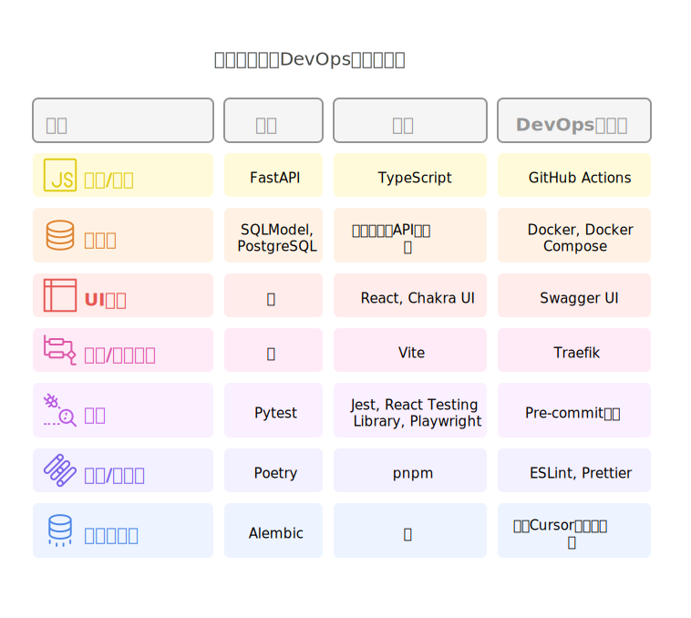

<p align="center">
    <images src="images/github-social-preview.png" width="60%" height="30%"/>
</p>

<h3 align="center" style="border-bottom: none">
    ⭐️  QuickForge AI - 快速构建AI应用的全栈模板 ⭐️ <br>
</h3>

<p align=center>
<images src="https://images.shields.io/badge/QuickForge-AI-blue" alt="QuickForge AI">
<images src="https://images.shields.io/badge/FastAPI-0.104.0-green" alt="FastAPI">
<images src="https://images.shields.io/badge/TypeScript-5.2.2-blue" alt="TypeScript">
<images src="https://images.shields.io/badge/license-MIT-brightgreen" alt="License">
</p>

<p align="center">
    <a href="./README.md"><b>English</b></a> •
    <a href="./README_zh-CN.md"><b>中文</b></a>
</p>

<br>

QuickForge AI是一个生产级全栈模板，结合了FastAPI (Python)和TypeScript，用于快速AI原型开发。专为自由职业者和AI创业者设计，他们需要迅速构建和部署具有现代开发实践的专业应用程序。

## 🚀 功能特点

- **FastAPI后端**：高性能Python API，自动生成OpenAPI文档
- **TypeScript前端**：类型安全的前端，采用现代React设置
- **AI就绪**：预配置的常见AI服务和工具集成
- **开发者体验**：针对Cursor和其他AI驱动的开发工具进行了优化
- **生产质量**：完整的测试框架、CI/CD流程和部署选项
- **Docker集成**：容器化的开发和部署工作流
- **认证系统**：JWT认证，安全密码哈希
- **邮件集成**：密码恢复和通知系统
- **深色模式支持**：具有明/暗主题切换的现代UI
- **数据库迁移**：使用Alembic进行自动模式管理

## 📋 技术栈

<p align="center">
  
</p>

### 架构图

**系统架构**




### 后端
- FastAPI用于高性能API端点
- SQLModel用于SQL数据库交互(ORM)
- Pydantic用于数据验证
- PostgreSQL作为SQL数据库
- Alembic用于数据库迁移
- Pytest用于测试
- Poetry用于依赖管理

```mermaid
graph TD
    %% 定义顶层应用
    fastapi_app[FastAPI Application]

    %% 定义FastAPI实例
    fastapi_instance[FastAPI App Instance]
    fastapi_app --> fastapi_instance;

    %% 定义API路由子图
    subgraph api_routes [API Routes]
        direction LR
        login_router[Login Router<br/>/login]
        users_router[Users Router<br/>/users]
        items_router[Items Router<br/>/items]
        utils_router[Utils Router<br/>/utils]
    end
    fastapi_instance --> api_routes;

    %% 定义设置
    settings[Settings<br/>Core Configuration]

    %% 定义数据层子图
    subgraph data_layer [Data Layer]
        direction TB
        crud[CRUD Operations]
        sql_models[SQLModel Models]
        alembic[Alembic Migrations]
        crud --> sql_models;
    end

    %% 定义核心系统子图
    subgraph core_systems [Core Systems]
        direction TB
        jwt[JWT Authentication]
        email[Email Utilities]
        di[Dependency Injection]
        db_conn[Database Connection]
        jwt --> db_conn;
        email --> db_conn;
        di --> db_conn;
    end

    %% 定义连接
    fastapi_instance --> settings;
    settings --> crud;
    login_router --> crud;
    users_router --> crud;
    items_router --> crud;
    utils_router --> email;
    login_router --> jwt;
    users_router --> jwt;
    items_router --> jwt;
    login_router --> di;
    users_router --> di;
    items_router --> di;
    utils_router --> di;
    sql_models --> db_conn;
    alembic --> db_conn;


    %% 样式 (可选，增加可读性)
    classDef default fill:#f9f9f9,stroke:#333,stroke-width:1px,rx:5,ry:5;
    classDef subgraph fill:#f0f0f0,stroke:#ccc,stroke-width:1px,rx:5,ry:5;
    classDef important fill:#e6f7ff,stroke:#91d5ff,stroke-width:1px,rx:5,ry:5;
    classDef data fill:#fffbe6,stroke:#ffe58f,stroke-width:1px,rx:5,ry:5;
    classDef core fill:#d9f7be,stroke:#b7eb8f,stroke-width:1px,rx:5,ry:5;

    class fastapi_app,fastapi_instance important;
    class api_routes,data_layer,core_systems subgraph;
    class login_router,users_router,items_router,utils_router,settings default;
    class crud,sql_models,alembic data;
    class jwt,email,di,db_conn core;
```


### 前端
- TypeScript提供类型安全
- React和hooks用于UI组件
- Chakra UI用于响应式、无障碍组件
- Vite用于快速构建
- 自动生成的API客户端
- Jest和React Testing Library用于测试
- Playwright用于端到端测试
- pnpm用于包管理

```mermaid
graph TD
    %% 定义顶层应用
    react_app[React Application]

    %% 定义应用入口点
    entry_point[Application Entry Point]
    react_app --> entry_point;

    %% 定义 Providers 子图
    subgraph providers_sg [Providers]
        direction LR
        chakra[Chakra UI Provider]
        tanstack_query[TanStack Query Provider]
        tanstack_router[TanStack Router Provider]
    end
    entry_point --> providers_sg;

    %% 定义 Routes 子图
    subgraph routes_sg [Routes]
        direction LR
        public_routes[Public Routes<br/>Login, Signup, etc.]
        private_routes[Private Routes<br/>Dashboard, Users, Items]
    end
    providers_sg --> routes_sg;

    %% 定义 Components 子图
    subgraph components_sg [Components]
        direction LR
        ui_comp[UI Components<br/>Forms, Tables, etc.]
        layout_comp[Layout Components<br/>Sidebar, Navbar]
    end

    %% 定义 API Integration 子图
    subgraph api_int_sg [API Integration]
        direction TB
        auth_module[Authentication Module]
        openapi_client[Generated OpenAPI Client]
        auth_module --> openapi_client;
    end

    %% 定义连接
    public_routes --> ui_comp;
    public_routes --> layout_comp;
    private_routes --> ui_comp;
    private_routes --> layout_comp;
    private_routes --> api_int_sg;
    ui_comp --> openapi_client;


    %% 样式 (可选，增加可读性)
    classDef default fill:#f9f9f9,stroke:#333,stroke-width:1px,rx:5,ry:5;
    classDef subgraph fill:#f0f0f0,stroke:#ccc,stroke-width:1px,rx:5,ry:5;
    classDef entry fill:#e6f7ff,stroke:#91d5ff,stroke-width:1px,rx:5,ry:5;
    classDef provider fill:#fffbe6,stroke:#ffe58f,stroke-width:1px,rx:5,ry:5;
    classDef route fill:#d9f7be,stroke:#b7eb8f,stroke-width:1px,rx:5,ry:5;
    classDef component fill:#fff0f6,stroke:#ffadd2,stroke-width:1px,rx:5,ry:5;
    classDef api fill:#f6ffed,stroke:#d9f7be,stroke-width:1px,rx:5,ry:5;


    class react_app default;
    class entry_point entry;
    class providers_sg,routes_sg,components_sg,api_int_sg subgraph;
    class chakra,tanstack_query,tanstack_router provider;
    class public_routes,private_routes route;
    class ui_comp,layout_comp component;
    class auth_module,openapi_client api;
```

### DevOps和工具
- GitHub Actions用于CI/CD
- Docker和Docker Compose
- Pre-commit钩子用于代码质量
- ESLint和Prettier用于代码格式化
- 针对Cursor优化的项目结构
- Swagger UI用于API文档
- Traefik作为反向代理/负载均衡器


## 🛠️ 快速开始

### 先决条件
- Python 3.10+
- Node.js 18+
- Docker和Docker Compose（可选但推荐）
- Git

### 快速安装

```bash
# 克隆仓库
git clone https://github.com/telepace/quick-forge-ai.git
cd quick-forge-ai

# 使用自动脚本设置
./setup.sh

# 或手动设置：

# 后端设置
cd backend
python -m venv venv
source venv/bin/activate  # Windows系统：venv\Scripts\activate
pip install poetry
poetry install

# 前端设置
cd ../frontend
pnpm install

# 启动开发服务器
docker-compose up  # 启动所有服务
```

### 配置

在根目录创建一个`.env`文件，基于提供的`.env.example`。需要更新的重要值：

```bash
# 使用以下命令生成安全密钥：
python -c "import secrets; print(secrets.token_urlsafe(32))"

# 必需的安全设置
SECRET_KEY=你生成的密钥
FIRST_SUPERUSER=admin@example.com
FIRST_SUPERUSER_PASSWORD=你的安全密码
POSTGRES_PASSWORD=你的数据库密码

# 可选的邮件设置
SMTP_HOST=
SMTP_USER=
SMTP_PASSWORD=
EMAILS_FROM_EMAIL=info@example.com
```

## 🧪 测试

```bash
# 运行后端测试
cd backend
pytest

# 运行前端测试
cd frontend
pnpm test

# 运行端到端测试
cd e2e
pnpm test
```

## 📦 项目结构

```
quick-forge-ai/
├── .github/                # GitHub工作流和模板
├── backend/                # FastAPI应用
│   ├── app/                # API代码
│   │   ├── api/            # API端点
│   │   ├── core/           # 配置
│   │   ├── db/             # 数据库模型和配置
│   │   ├── services/       # 业务逻辑
│   │   └── utils/          # 实用函数
│   ├── tests/              # 后端测试
│   ├── alembic/            # 数据库迁移
│   ├── poetry.lock         # 锁定的依赖
│   └── pyproject.toml      # Python项目配置
├── frontend/               # TypeScript React应用
│   ├── src/                # 应用代码
│   │   ├── components/     # React组件
│   │   ├── hooks/          # 自定义React钩子
│   │   ├── pages/          # 页面组件
│   │   ├── services/       # API服务集成
│   │   ├── types/          # TypeScript类型
│   │   └── utils/          # 实用函数
│   ├── tests/              # 前端测试
│   ├── package.json        # npm包配置
│   └── vite.config.ts      # Vite配置
├── e2e/                    # 使用Playwright的端到端测试
├── docker/                 # Docker配置
│   ├── backend/            # 后端Dockerfile
│   └── frontend/           # 前端Dockerfile
├── docs/                   # 文档
├── scripts/                # 实用脚本
├── docker-compose.yml      # Docker Compose配置
├── docker-compose.prod.yml # 生产Docker Compose
└── README.md               # 本文件
```

## 🚢 部署

### Docker部署

```bash
# 以生产模式构建和运行
docker-compose -f docker-compose.prod.yml up -d
```

部署包括：
- 通过Traefik自动HTTPS证书管理
- 生产优化的Docker镜像
- 数据库备份配置

查看[部署文档](./docs/deployment.md)获取关于部署到各种平台的详细说明。

## 🔄 开发工作流

### 与Cursor一起使用

此模板针对Cursor进行了优化：

1. 在Cursor中打开项目
2. 使用AI代码补全来导航和修改代码
3. 利用`.cursor/`目录中的自定义Cursor命令
4. 享受AI驱动开发带来的生产力提升

### AI集成开发

QuickForge AI使集成各种AI服务变得简单：

- 预配置流行AI API的连接器
- 常见AI模式的示例实现
- 为AI驱动功能构建的结构化组件
- 用于处理AI特定数据流的辅助工具

### 开发最佳实践

- 为新功能使用特性分支
- 为所有新代码编写测试
- 提交前运行pre-commit钩子
- 遵循贡献指南

## 📚 文档

- [后端API文档](http://localhost:8000/docs) - 后端运行时可用
- [前端组件文档](http://localhost:3000/docs) - 前端运行时可用
- [项目架构](./docs/architecture.md)
- [开发指南](./docs/development.md)

## 📱 UI预览

### 仪表盘登录


### 主仪表盘


### 深色模式支持


## 独立开发使用的工具推荐

+ [收录独立开发者出海技术栈和工具](https://github.com/weijunext/indie-hacker-tools)
+ [独立开发者工具站（Awesome Independent developer tools）](https://github.com/yaolifeng0629/Awesome-independent-tools)
+ [1000UserGuide：对独立开发者和创业者来说，找到前1000个早期用户太关键了。这里精心整理了300多个国内外渠道，适合独立开发者和创业者推广产品的渠道。](https://github.com/naxiaoduo/1000UserGuide)
+ [中国独立开发者项目列表](https://github.com/1c7/chinese-independent-developer)
+ [独立开发者必备技能及现代工具 & 分别的上手指导](https://nsddd.top/zh/posts/ai-projects/independent-developer/)


## 📄 许可证

本项目根据MIT许可证授权 - 详情见[LICENSE](LICENSE)文件。

## 👥 贡献

欢迎贡献！请查看我们的[贡献指南](CONTRIBUTING.md)了解详情。

## 🔄 从模板更新

如果您想在将来从模板获取更新：

```bash
# 添加模板作为远程
git remote add template https://github.com/telepace/quick-forge-ai.git

# 拉取更改（不自动合并）
git pull --no-commit template main

# 审查更改并提交
git merge --continue
```

## 🙏 致谢

- FastAPI团队提供的出色框架
- TypeScript团队提供的类型安全
- 所有使这一切成为可能的开源贡献者

---

为AI创业者和自由职业者用❤️构建。祝编码愉快！ 