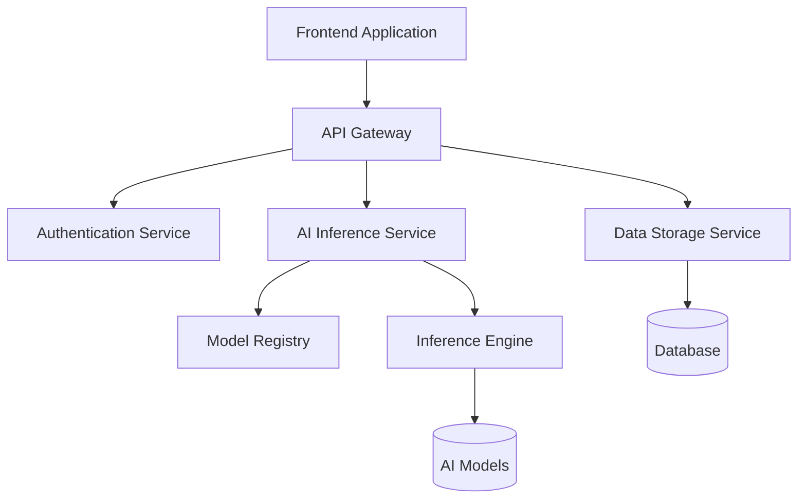

# Quick Forge AI Technical Architecture Analysis

In this article, we will delve into the technical architecture of Quick Forge AI, explaining our design decisions and how we achieved a high-performance, scalable AI application platform.

## System Architecture Overview

Quick Forge AI adopts a modern microservices architecture, consisting of the following core components:



### Frontend Architecture

Our frontend is built using React and Next.js, with Tailwind CSS for styling. The core architecture is as follows:

```jsx
// Application architecture example
import { AIProvider } from 'quick-forge-ai/client';
import { ThemeProvider } from './theme';
import { AuthProvider } from './auth';

function Application({ children }) {
  return (
    <ThemeProvider>
      <AuthProvider>
        <AIProvider
          apiKey={process.env.NEXT_PUBLIC_AI_API_KEY}
          endpoint="/api/ai"
        >
          {children}
        </AIProvider>
      </AuthProvider>
    </ThemeProvider>
  );
}
```

### Backend Architecture

The backend is built using FastAPI (Python), providing a unified interface for different types of AI functionalities:

```python
from fastapi import FastAPI, Depends, HTTPException
from app.core.auth import get_current_user
from app.services.ai import AIService

app = FastAPI()
ai_service = AIService()

@app.post("/api/v1/completions")
async def create_completion(
    request: CompletionRequest,
    current_user = Depends(get_current_user)
):
    try:
        result = await ai_service.generate_completion(
            prompt=request.prompt,
            model=request.model,
            max_tokens=request.max_tokens,
            user_id=current_user.id
        )
        return CompletionResponse(text=result.text)
    except Exception as e:
        raise HTTPException(status_code=500, detail=str(e))
```

## Core Technology Stack

The core technology stack of Quick Forge AI includes:

| Level | Technology |
|------|------|
| Frontend | React, Next.js, TailwindCSS |
| API Layer | FastAPI, GraphQL |
| Business Logic | Python, TypeScript |
| AI Engine | PyTorch, Transformers |
| Data Storage | PostgreSQL, Redis |
| Infrastructure | Docker, Kubernetes, AWS |

## Performance Optimization Techniques

### Model Quantization and Optimization

We have employed various techniques to optimize model performance:

```python
# Model quantization example
from transformers import AutoModelForCausalLM
import torch

def load_optimized_model(model_id, device):
    # Load 8-bit quantized model to reduce memory usage
    model = AutoModelForCausalLM.from_pretrained(
        model_id,
        device_map="auto",
        torch_dtype=torch.float16,
        load_in_8bit=True
    )
    return model
```

### Distributed Inference

For large models, we have implemented a distributed inference system:

```python
# Distributed inference example
class DistributedInference:
    def __init__(self, model_id, num_shards=2):
        self.devices = [f"cuda:{i}" for i in range(num_shards)]
        self.model_shards = self._load_sharded_model(model_id, num_shards)
    
    def _load_sharded_model(self, model_id, num_shards):
        # Load model shards onto multiple GPUs
        # ...implementation code...
        return model_shards
    
    async def generate(self, prompt):
        # Coordinate model shards on multiple GPUs for inference
        # ...implementation code...
        return result
```

## Scalability Design

The core design principle of Quick Forge AI is scalability, which we achieve through:

1. **Modular Components**: All functionalities are implemented as independent modules, allowing for individual scaling or replacement
2. **Plugin System**: Supports third-party plugin development
3. **Horizontal Scaling**: All services are designed for horizontal scaling

```typescript
// Plugin system example
export interface AIPlugin {
  id: string;
  name: string;
  description: string;
  version: string;
  init(context: PluginContext): Promise<void>;
  execute(input: PluginInput): Promise<PluginOutput>;
}

export class PluginRegistry {
  private plugins: Map<string, AIPlugin> = new Map();
  
  register(plugin: AIPlugin): void {
    this.plugins.set(plugin.id, plugin);
    console.log(`Plugin ${plugin.name} v${plugin.version} registered`);
  }
  
  async executePlugin(pluginId: string, input: PluginInput): Promise<PluginOutput> {
    const plugin = this.plugins.get(pluginId);
    if (!plugin) {
      throw new Error(`Plugin ${pluginId} not found`);
    }
    return await plugin.execute(input);
  }
}
```

## Security and Privacy

We take security and privacy very seriously, implementing multi-layered protection measures:

1. **End-to-End Encryption**: All communication is encrypted using TLS/SSL
2. **Data Isolation**: Each user's data is strictly isolated
3. **Least Privilege Principle**: Services and components only receive necessary permissions

```typescript
// Security model example
interface SecureContext {
  userId: string;
  tenantId: string;
  permissions: string[];
}

function checkPermission(context: SecureContext, requiredPermission: string): boolean {
  return context.permissions.includes(requiredPermission);
}

async function executeSecureOperation(
  context: SecureContext,
  operation: () => Promise<any>,
  requiredPermission: string
): Promise<any> {
  if (!checkPermission(context, requiredPermission)) {
    throw new Error('Permission denied');
  }
  
  // Log audit event
  logAuditEvent({
    userId: context.userId,
    tenantId: context.tenantId,
    operation: operation.name,
    timestamp: new Date()
  });
  
  return await operation();
}
```

## Future Technology Roadmap

Our technology roadmap includes:

- **Multimodal Support**: Expansion to image, audio, and video processing
- **On-Premise Deployment Option**: Support for fully private deployments
- **Advanced Fine-Tuning Tools**: Simpler model customization tools
- **Federated Learning**: Privacy-preserving distributed learning system

## Conclusion

The technical architecture design of Quick Forge AI aims to provide a flexible, efficient, and secure AI application development platform. Through modular design and scalable architecture, we can quickly adapt to the development of AI technology, offering developers the most advanced tools and services.

---

We look forward to your feedback! If you have any technical questions or suggestions, please discuss with us on the [GitHub discussion board](https://github.com/telepace/quick-forge-ai/discussions). 