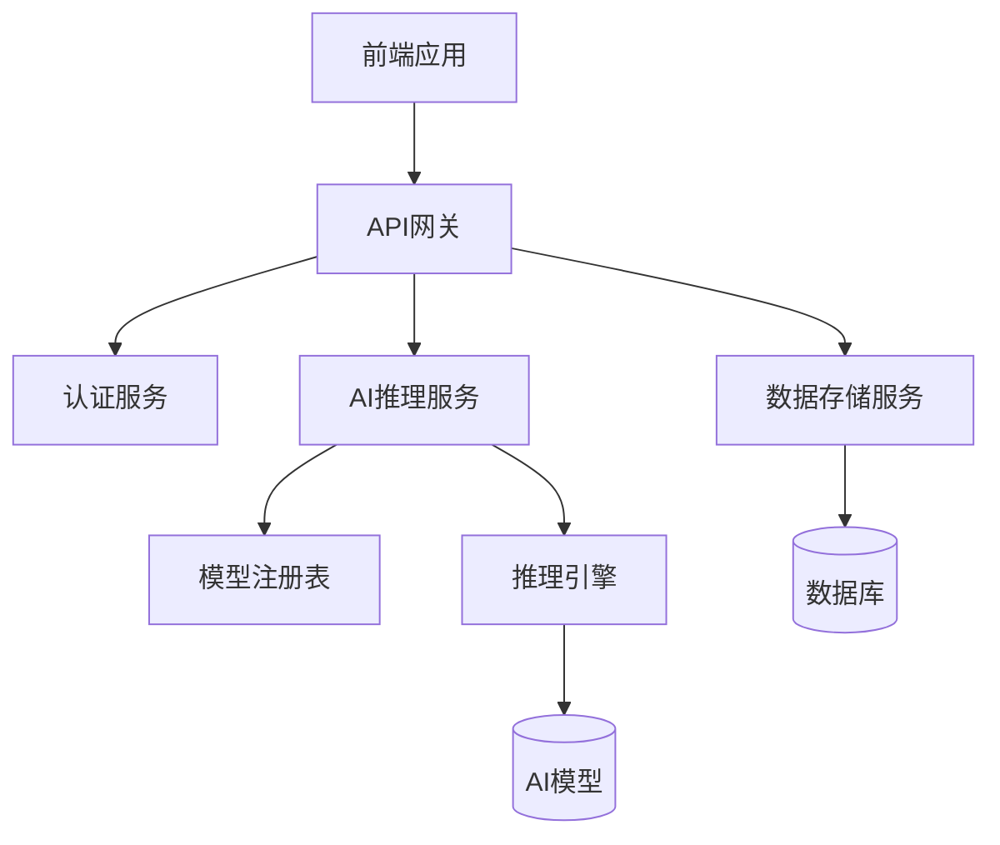

# Quick Forge AI 技术架构解析

在本文中，我们将深入探讨 Quick Forge AI 的技术架构，解释我们的设计决策，以及如何实现高性能、可扩展的 AI 应用平台。

## 系统架构概览

Quick Forge AI 采用了现代化的微服务架构，由以下几个核心组件组成：



### 前端架构

我们的前端采用 React 和 Next.js 构建，使用 Tailwind CSS 进行样式设计。核心架构如下：

```jsx
// 应用架构示例
import { AIProvider } from 'quick-forge-ai/client';
import { ThemeProvider } from './theme';
import { AuthProvider } from './auth';

function Application({ children }) {
  return (
    <ThemeProvider>
      <AuthProvider>
        <AIProvider
          apiKey={process.env.NEXT_PUBLIC_AI_API_KEY}
          endpoint="/api/ai"
        >
          {children}
        </AIProvider>
      </AuthProvider>
    </ThemeProvider>
  );
}
```

### 后端架构

后端使用 FastAPI（Python）构建，为不同类型的 AI 功能提供统一的接口：

```python
from fastapi import FastAPI, Depends, HTTPException
from app.core.auth import get_current_user
from app.services.ai import AIService

app = FastAPI()
ai_service = AIService()

@app.post("/api/v1/completions")
async def create_completion(
    request: CompletionRequest,
    current_user = Depends(get_current_user)
):
    try:
        result = await ai_service.generate_completion(
            prompt=request.prompt,
            model=request.model,
            max_tokens=request.max_tokens,
            user_id=current_user.id
        )
        return CompletionResponse(text=result.text)
    except Exception as e:
        raise HTTPException(status_code=500, detail=str(e))
```

## 核心技术栈

Quick Forge AI 的核心技术栈包括：

| 层级 | 技术 |
|------|------|
| 前端 | React, Next.js, TailwindCSS |
| API层 | FastAPI, GraphQL |
| 业务逻辑 | Python, TypeScript |
| AI引擎 | PyTorch, Transformers |
| 数据存储 | PostgreSQL, Redis |
| 基础设施 | Docker, Kubernetes, AWS |

## 性能优化技术

### 模型量化与优化

我们使用了多种技术来优化模型性能：

```python
# 模型量化示例
from transformers import AutoModelForCausalLM
import torch

def load_optimized_model(model_id, device):
    # 加载8位量化模型以减少内存使用
    model = AutoModelForCausalLM.from_pretrained(
        model_id,
        device_map="auto",
        torch_dtype=torch.float16,
        load_in_8bit=True
    )
    return model
```

### 分布式推理

对于大型模型，我们实现了分布式推理系统：

```python
# 分布式推理示例
class DistributedInference:
    def __init__(self, model_id, num_shards=2):
        self.devices = [f"cuda:{i}" for i in range(num_shards)]
        self.model_shards = self._load_sharded_model(model_id, num_shards)
    
    def _load_sharded_model(self, model_id, num_shards):
        # 将模型分片加载到多个GPU上
        # ...实现代码...
        return model_shards
    
    async def generate(self, prompt):
        # 协调多个GPU上的模型分片进行推理
        # ...实现代码...
        return result
```

## 可扩展性设计

Quick Forge AI 的核心设计原则是可扩展性，我们通过以下方式实现：

1. **模块化组件**: 所有功能都是作为独立模块实现的，可以单独扩展或替换
2. **插件系统**: 支持第三方插件开发
3. **水平扩展**: 所有服务都设计为可水平扩展

```typescript
// 插件系统示例
export interface AIPlugin {
  id: string;
  name: string;
  description: string;
  version: string;
  init(context: PluginContext): Promise<void>;
  execute(input: PluginInput): Promise<PluginOutput>;
}

export class PluginRegistry {
  private plugins: Map<string, AIPlugin> = new Map();
  
  register(plugin: AIPlugin): void {
    this.plugins.set(plugin.id, plugin);
    console.log(`Plugin ${plugin.name} v${plugin.version} registered`);
  }
  
  async executePlugin(pluginId: string, input: PluginInput): Promise<PluginOutput> {
    const plugin = this.plugins.get(pluginId);
    if (!plugin) {
      throw new Error(`Plugin ${pluginId} not found`);
    }
    return await plugin.execute(input);
  }
}
```

## 安全与隐私

我们非常重视安全和隐私，实现了多层次的保护措施：

1. **端到端加密**: 所有通信都使用 TLS/SSL 加密
2. **数据隔离**: 每个用户的数据严格隔离
3. **最小权限原则**: 服务和组件仅获得必要的权限

```typescript
// 安全模型示例
interface SecureContext {
  userId: string;
  tenantId: string;
  permissions: string[];
}

function checkPermission(context: SecureContext, requiredPermission: string): boolean {
  return context.permissions.includes(requiredPermission);
}

async function executeSecureOperation(
  context: SecureContext,
  operation: () => Promise<any>,
  requiredPermission: string
): Promise<any> {
  if (!checkPermission(context, requiredPermission)) {
    throw new Error('Permission denied');
  }
  
  // 记录审计日志
  logAuditEvent({
    userId: context.userId,
    tenantId: context.tenantId,
    operation: operation.name,
    timestamp: new Date()
  });
  
  return await operation();
}
```

## 未来技术规划

我们的技术路线图包括：

- **多模态支持**: 扩展到图像、音频和视频处理
- **本地部署选项**: 支持完全私有化部署
- **高级微调工具**: 更简单的模型定制工具
- **联合学习**: 保护隐私的分布式学习系统

## 结论

Quick Forge AI 的技术架构设计旨在提供灵活、高效、安全的 AI 应用开发平台。通过模块化设计和可扩展架构，我们能够快速适应 AI 技术的发展，为开发者提供最先进的工具和服务。

---

我们期待您的反馈！如果您有任何技术问题或建议，请在 [GitHub 讨论区](https://github.com/telepace/quick-forge-ai/discussions) 与我们交流。 