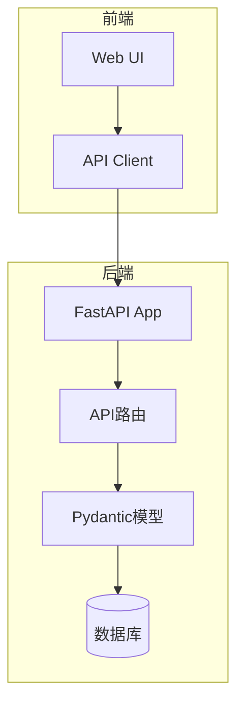

# 使用FastAPI构建API客户端

在快速开发现代Web应用时，构建高效、可靠的API客户端是至关重要的一步。本文将介绍如何在Quick Forge AI项目中结合FastAPI模板创建强大的API客户端。

## 为什么需要API客户端？

API客户端在全栈应用中扮演着重要角色：

1. **类型安全** - 提供完整的类型检查和自动补全
2. **代码复用** - 前端和后端共享相同的数据模型
3. **自动生成** - 减少手动编写重复代码的工作
4. **版本控制** - 确保前端始终与后端API保持同步

## 项目架构

下面是Quick Forge AI项目与API客户端的架构图：



## 实现API客户端

### 1. 自动生成API客户端

在Quick Forge AI项目中，我们可以使用OpenAPI规范自动生成API客户端。首先确保FastAPI后端正确配置：

```typescript
// 配置API客户端生成
export const apiClientConfig = {
  schemaUrl: 'http://localhost:8000/openapi.json',
  outputPath: './src/lib/api-client',
  clientName: 'QuickForgeApiClient'
};
```

### 2. 创建基本客户端包装器

```typescript
import { QuickForgeApiClient } from '../lib/api-client';

export class ApiService {
  private static instance: ApiService;
  private client: QuickForgeApiClient;

  private constructor() {
    this.client = new QuickForgeApiClient({
      BASE: process.env.NEXT_PUBLIC_API_URL || 'http://localhost:8000',
      WITH_CREDENTIALS: true
    });
  }

  public static getInstance(): ApiService {
    if (!ApiService.instance) {
      ApiService.instance = new ApiService();
    }
    return ApiService.instance;
  }

  // 示例方法
  public async getUsers() {
    return this.client.api.users.getUsers();
  }
}

// 导出单例实例
export const apiService = ApiService.getInstance();
```

## 在Quick Forge AI中集成

将API客户端集成到Quick Forge AI项目中非常简单：

1. 在构建过程中自动生成客户端代码
2. 使用统一的API服务类访问后端功能
3. 利用类型检查确保API调用的正确性

```typescript
// 在React组件中使用
import { apiService } from '@/lib/api-service';
import { useState, useEffect } from 'react';

export function UserList() {
  const [users, setUsers] = useState([]);
  
  useEffect(() => {
    const fetchUsers = async () => {
      const response = await apiService.getUsers();
      setUsers(response.data);
    };
    fetchUsers();
  }, []);
  
  return (
    <div>
      <h2>用户列表</h2>
      <ul>
        {users.map(user => (
          <li key={user.id}>{user.name}</li>
        ))}
      </ul>
    </div>
  );
}
```

## 最佳实践

在Quick Forge AI项目中使用API客户端时，请遵循以下最佳实践：

1. **保持模型同步** - 确保前端和后端模型保持同步
2. **错误处理** - 实现全局错误处理机制
3. **认证** - 添加认证令牌和刷新逻辑
4. **缓存** - 实现简单的请求缓存以提高性能
5. **请求拦截** - 添加请求和响应拦截器以便集中处理逻辑

## 结论

使用FastAPI构建API客户端可以大大提高Quick Forge AI项目的开发效率和代码质量。通过自动生成的类型安全客户端，您可以专注于构建业务逻辑，而不必担心API调用的正确性和兼容性问题。

下一步，我们将探讨如何在Quick Forge AI项目中实现更高级的API功能，如实时通信和文件上传。敬请期待！ 