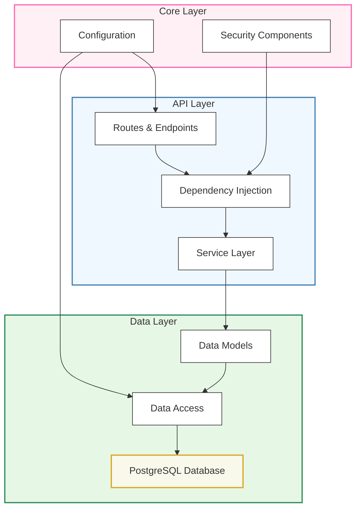

# Backend Development

The Quick Forge AI backend is built with FastAPI, a modern, high-performance web framework for building APIs with Python. This section covers the backend architecture, key components, and how to extend the backend as needed.

## Architecture Overview

The backend follows a layered architecture:



This separation of concerns makes the codebase more maintainable and extensible.

## Key Technologies

- **FastAPI**: High-performance web framework
- **SQLModel**: Type-safe SQL database interactions
- **Pydantic**: Data validation and settings management
- **Alembic**: Database migration system
- **JWT**: Authentication tokens
- **Pytest**: Testing framework

## Directory Structure

```
backend/
├── app/
│   ├── api/             # API endpoints and routes
│   │   ├── deps.py      # Dependency injection
│   │   └── routes/      # API route modules
│   ├── core/            # Core configuration
│   │   ├── config.py    # Application settings
│   │   └── security.py  # Security utilities
│   ├── db/              # Database
│   │   ├── base.py      # Base models
│   │   ├── session.py   # Database session
│   │   └── models/      # Database models
│   ├── services/        # Business logic
│   ├── utils/           # Utility functions
│   └── main.py          # Application entry point
├── tests/               # Test modules
├── alembic/             # Database migrations
│   └── versions/        # Migration scripts
└── pyproject.toml       # Project dependencies
```

## Getting Started with Backend Development

To get started with backend development:

1. **Understand Existing Code**:
   - Familiarize yourself with API routes in `app/api/routes/`
   - Review data models in `app/db/models/`
   - Check service implementations in `app/services/`

2. **Set Up Development Environment**:
   - Follow the [setup instructions](/en/docs/getting-started)
   - Activate the Python virtual environment
   - Run the backend with hot-reload: `uvicorn app.main:app --reload`

3. **Access API Documentation**:
   - Once running, view Swagger UI at `http://localhost:8000/docs`
   - OpenAPI schema is at `http://localhost:8000/api/v1/openapi.json`

## Major Components

### API Routes

API routes are organized by functional area in the `app/api/routes/` directory. Each module contains related endpoints, such as:

- `users.py` - User management operations
- `auth.py` - Authentication and authorization
- `items.py` - Item CRUD operations

### Dependency Injection

FastAPI's dependency injection system is extensively used for:
- Injecting database sessions
- Validating authentication and permissions
- Sharing common functionality

Dependencies are defined in `app/api/deps.py`.

### Database Models

Data models are defined using SQLModel, which combines the benefits of SQLAlchemy and Pydantic. Models are located in `app/db/models/`.

### Business Logic

Complex business logic is separated into service modules in `app/services/`, keeping route handlers clean and focused on HTTP concerns.

## Core Features

### User Management

The system provides complete user management functionality:

- User registration and login
- Role and permission management
- Password reset
- User profile updates

### Authentication and Authorization

The security system is based on:

- JWT token authentication
- Role-based access control
- Secure password hashing
- Guards against common attacks

### Data Validation

All input data is validated through Pydantic models:

- Type checking (runtime and static, with TypeScript exports)
- Field constraints (min/max length, regex, etc.)
- Complex business rule validation

### Database Interaction

Data access is through:

- SQLModel ORM
- Asynchronous database operations
- Transaction support
- Alembic database migrations

## Extending the Backend

To extend backend functionality:

1. **Define Data Models**:
   - Create new SQLModel classes in `app/db/models/`
   - Run Alembic migrations to update database structure

2. **Implement Service Layer**:
   - Add business logic in `app/services/`
   - Keep services independent of HTTP and database concerns

3. **Create API Routes**:
   - Add new endpoints in `app/api/routes/`
   - Register routes in `app/api/api.py`

4. **Write Tests**:
   - Add unit and integration tests for new functionality
   - Ensure compatibility with existing features

## Help Guides

### Detailed Documentation

Check out these topics to learn more about the backend:

- [FastAPI Development Workflow](/en/docs/backend/development-workflow)
- [FastAPI Models and Database](/en/docs/backend/fastapi-models-and-database)

### Development Best Practices

- **Keep Routes Simple**: Move business logic to service layer
- **Use Dependency Injection**: Reuse common functionality and enforce access control
- **Validate All Input**: Use Pydantic models to ensure data integrity
- **Write Tests**: Create unit and integration tests for all critical functionality
- **Follow API Design Principles**: Use appropriate HTTP methods, status codes, and response formats

## Troubleshooting

### Common Issues

1. **Database Migration Errors**:
   - Ensure all migrations are applied: `alembic upgrade head`
   - Check if model changes are consistent with migration scripts

2. **Authentication Problems**:
   - Validate JWT token configuration (keys, algorithm, expiration)
   - Check permission validation in dependency chains

3. **Performance Issues**:
   - Optimize database queries and indexes
   - Implement caching strategies
   - Use database profiling tools to identify bottlenecks

### Debugging Tips

- Use Swagger UI (`/docs`) to test API endpoints
- Check log output for detailed error information
- Use FastAPI's debug mode: `uvicorn app.main:app --reload --debug` 