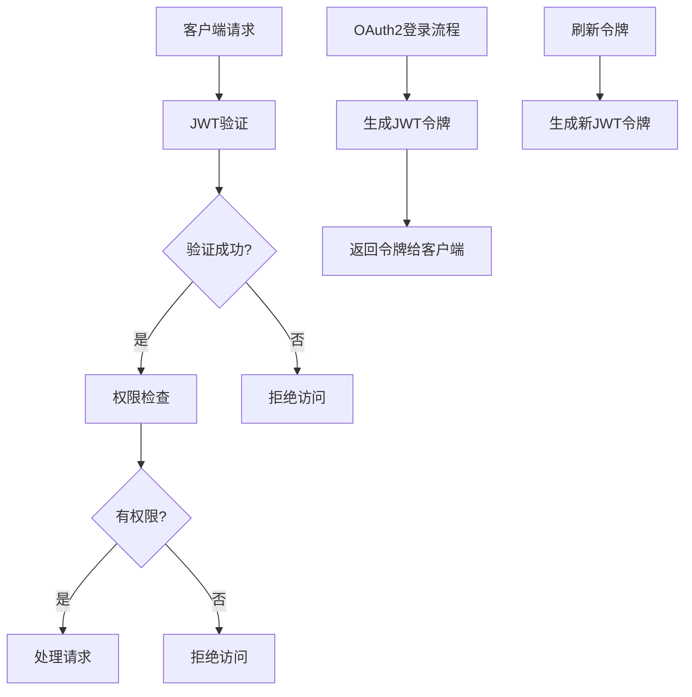
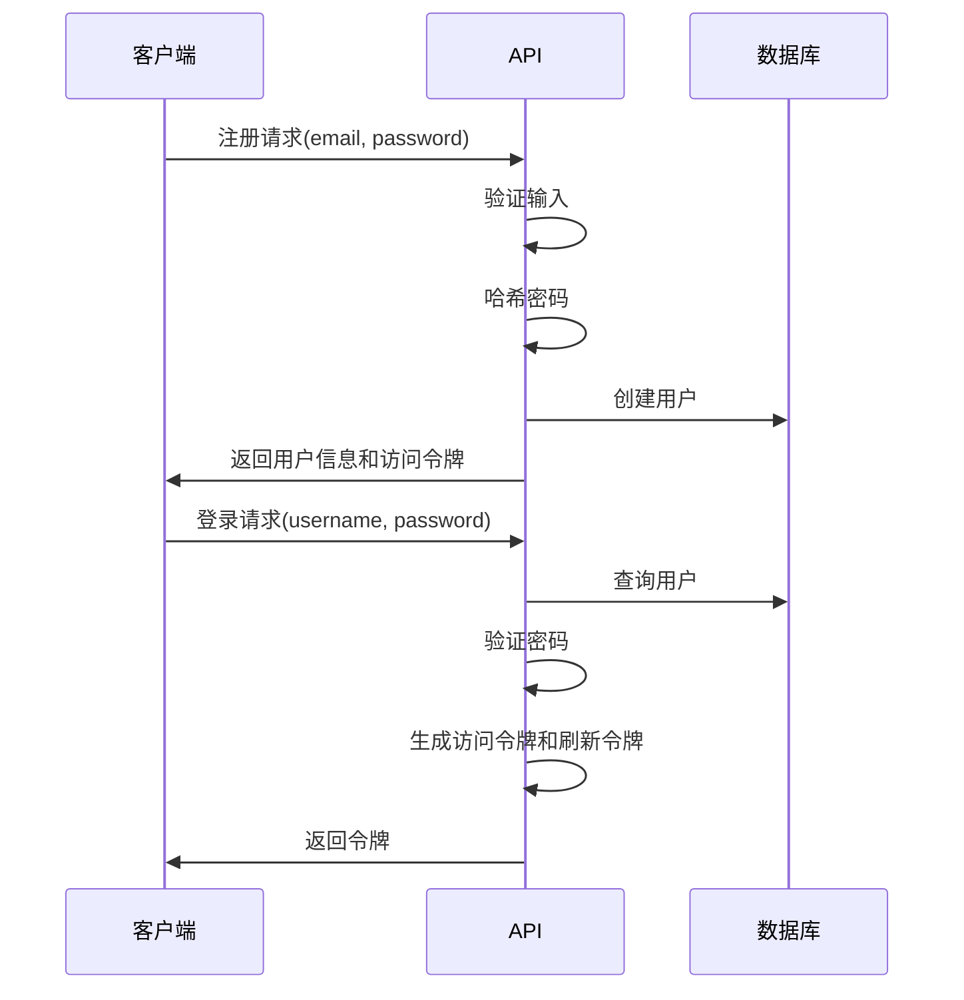
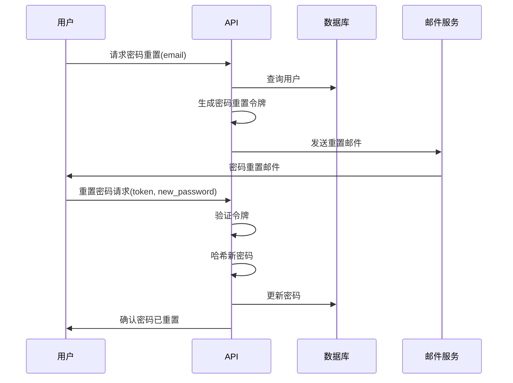
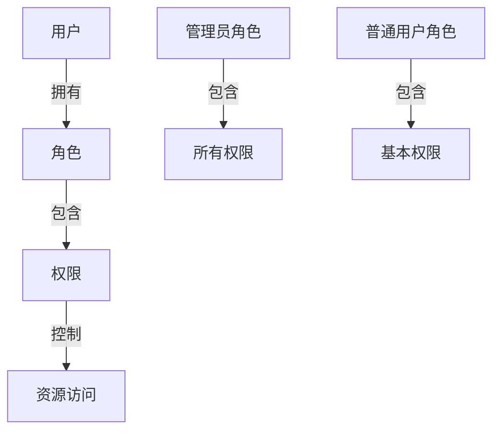

# 认证与用户管理

本文档详细介绍Quick Forge AI项目中的认证机制和用户管理系统。通过了解这些核心安全功能，您可以有效地实施和定制应用程序的身份验证和授权流程。

## 认证技术栈概述

Quick Forge AI采用了现代且安全的认证技术栈：

* **JWT (JSON Web Tokens)**：用于无状态身份验证
* **OAuth2**：实现标准授权框架与密码流程
* **密码哈希**：使用安全算法存储用户密码
* **HTTPS**：在生产环境中配置TLS安全传输
* **CORS (跨源资源共享)**：控制API访问权限



## 用户身份验证流程

### 注册与登录过程

系统提供完整的用户生命周期管理功能：



### 令牌认证系统

系统使用两种类型的令牌：

1. **访问令牌 (JWT)**：短期有效(通常120分钟)，用于API访问
2. **刷新令牌**：长期有效(通常7-30天)，用于获取新的访问令牌

当访问令牌过期时，客户端可以使用刷新令牌获取新的访问令牌，无需用户重新登录。

## 核心安全实现

### JWT配置与管理

JWT令牌的生成和验证：

```python
# 生成JWT访问令牌
def create_access_token(subject: Union[str, Any], expires_delta: timedelta = None) -> str:
    if expires_delta:
        expire = datetime.utcnow() + expires_delta
    else:
        expire = datetime.utcnow() + timedelta(
            minutes=settings.ACCESS_TOKEN_EXPIRE_MINUTES
        )
    to_encode = {"exp": expire, "sub": str(subject)}
    encoded_jwt = jwt.encode(to_encode, settings.SECRET_KEY, algorithm=settings.ALGORITHM)
    return encoded_jwt

# 验证JWT令牌
def verify_token(token: str) -> dict:
    try:
        payload = jwt.decode(
            token, settings.SECRET_KEY, algorithms=[settings.ALGORITHM]
        )
        return payload
    except JWTError:
        raise credentials_exception
```

### 密码安全存储

密码使用安全的哈希算法处理，确保即使数据库被入侵，用户密码也不会被泄露：

```python
def get_password_hash(password: str) -> str:
    """创建密码哈希"""
    return pwd_context.hash(password)

def verify_password(plain_password: str, hashed_password: str) -> bool:
    """验证密码与哈希是否匹配"""
    return pwd_context.verify(plain_password, hashed_password)
```

### 依赖注入认证系统

FastAPI的依赖注入系统是实现认证和授权的核心机制：

```python
# 获取当前登录用户
def get_current_user(
    db: Session = Depends(get_db), token: str = Depends(oauth2_scheme)
) -> User:
    """通过令牌识别当前用户"""
    try:
        payload = jwt.decode(
            token, settings.SECRET_KEY, algorithms=[settings.ALGORITHM]
        )
        token_data = TokenPayload(**payload)
    except (JWTError, ValidationError):
        raise HTTPException(
            status_code=status.HTTP_403_FORBIDDEN,
            detail="无法验证凭据",
        )
    user = crud.user.get(db, id=token_data.sub)
    if not user:
        raise HTTPException(status_code=404, detail="用户不存在")
    return user

# 获取当前活跃用户
def get_current_active_user(
    current_user: User = Depends(get_current_user),
) -> User:
    """确认用户处于活跃状态"""
    if not current_user.is_active:
        raise HTTPException(status_code=400, detail="用户未激活")
    return current_user

# 获取当前管理员用户
def get_current_admin_user(
    current_user: User = Depends(get_current_user),
) -> User:
    """确认用户具有管理员权限"""
    if not current_user.is_admin:
        raise HTTPException(
            status_code=403, detail="权限不足"
        )
    return current_user
```

## 用户管理功能

### 用户模型

用户模型定义了数据库中的用户结构：

```python
class User(SQLModel, table=True):
    """用户数据库模型"""
    id: Optional[int] = Field(default=None, primary_key=True)
    email: str = Field(unique=True, index=True)
    hashed_password: str
    full_name: Optional[str] = None
    is_active: bool = True
    is_admin: bool = False
    created_at: datetime = Field(default_factory=datetime.utcnow)
```

### 用户模式(Schema)

Pydantic模式用于验证和序列化用户数据：

```python
class UserBase(BaseModel):
    """用户基础模式"""
    email: EmailStr
    full_name: Optional[str] = None
    is_active: bool = True

class UserCreate(UserBase):
    """用户创建模式"""
    password: str

class UserUpdate(UserBase):
    """用户更新模式"""
    password: Optional[str] = None

class UserInDB(UserBase):
    """数据库中的用户模式"""
    id: int
    hashed_password: str
    is_admin: bool = False
    created_at: datetime

class User(UserBase):
    """API响应中的用户模式"""
    id: int
    is_admin: bool = False
    created_at: datetime

    class Config:
        orm_mode = True
```

### 用户CRUD操作

用户管理API支持完整的CRUD操作：

```python
# 创建新用户
@router.post("/", response_model=schemas.User)
def create_user(
    *,
    db: Session = Depends(deps.get_db),
    user_in: schemas.UserCreate,
    current_user: models.User = Depends(deps.get_current_admin_user),
) -> Any:
    """创建新用户（仅管理员）"""
    user = crud.user.get_by_email(db, email=user_in.email)
    if user:
        raise HTTPException(
            status_code=400,
            detail="此邮箱已被注册",
        )
    user = crud.user.create(db, obj_in=user_in)
    return user

# 获取用户列表
@router.get("/", response_model=List[schemas.User])
def read_users(
    db: Session = Depends(deps.get_db),
    skip: int = 0,
    limit: int = 100,
    current_user: models.User = Depends(deps.get_current_admin_user),
) -> Any:
    """获取用户列表（仅管理员）"""
    users = crud.user.get_multi(db, skip=skip, limit=limit)
    return users

# 获取用户信息
@router.get("/me", response_model=schemas.User)
def read_user_me(
    current_user: models.User = Depends(deps.get_current_active_user),
) -> Any:
    """获取当前登录用户信息"""
    return current_user

# 更新用户信息
@router.put("/me", response_model=schemas.User)
def update_user_me(
    *,
    db: Session = Depends(deps.get_db),
    user_in: schemas.UserUpdate,
    current_user: models.User = Depends(deps.get_current_active_user),
) -> Any:
    """更新当前登录用户信息"""
    user = crud.user.update(db, db_obj=current_user, obj_in=user_in)
    return user
```

## 密码重置流程

系统提供安全的密码重置功能：



### 密码重置路由

```python
@router.post("/password-recovery/{email}")
def recover_password(email: str, db: Session = Depends(deps.get_db)) -> Any:
    """
    创建密码恢复令牌并发送恢复邮件
    """
    user = crud.user.get_by_email(db, email=email)
    if not user:
        # 不透露用户是否存在
        return {"msg": "密码恢复邮件已发送"}
    password_reset_token = generate_password_reset_token(email=email)
    send_reset_password_email(
        email_to=user.email, token=password_reset_token, username=user.full_name
    )
    return {"msg": "密码恢复邮件已发送"}

@router.post("/reset-password/")
def reset_password(
    token: str = Body(...),
    new_password: str = Body(...),
    db: Session = Depends(deps.get_db),
) -> Any:
    """
    使用令牌重置密码
    """
    email = verify_password_reset_token(token)
    if not email:
        raise HTTPException(status_code=400, detail="无效的令牌")
    user = crud.user.get_by_email(db, email=email)
    if not user:
        raise HTTPException(
            status_code=404,
            detail="用户不存在",
        )
    elif not crud.user.is_active(user):
        raise HTTPException(status_code=400, detail="用户未激活")
    hashed_password = get_password_hash(new_password)
    user.hashed_password = hashed_password
    db.add(user)
    db.commit()
    return {"msg": "密码更新成功"}
```

## 角色与权限系统

Quick Forge AI实现了基于角色的访问控制(RBAC)：



### 权限检查机制

```python
def check_user_permissions(user: User, required_permissions: List[str]) -> bool:
    """检查用户是否拥有所需权限"""
    # 管理员拥有所有权限
    if user.is_admin:
        return True
    
    # 获取用户权限
    user_permissions = get_user_permissions(user)
    
    # 检查是否拥有所需的所有权限
    return all(perm in user_permissions for perm in required_permissions)

# 权限依赖项
def has_permissions(required_permissions: List[str]):
    """创建检查特定权限的依赖项"""
    def dependency(current_user: User = Depends(get_current_active_user)):
        if not check_user_permissions(current_user, required_permissions):
            raise HTTPException(
                status_code=403,
                detail="权限不足"
            )
        return current_user
    return dependency
```

## 前端集成

前端应用程序通过以下方式与认证系统集成：

### 登录请求

```typescript
// 登录API调用
async function login(email: string, password: string) {
  const formData = new FormData();
  formData.append('username', email);  // OAuth2要求使用username字段
  formData.append('password', password);
  
  const response = await fetch('/api/login/access-token', {
    method: 'POST',
    body: formData
  });
  
  if (!response.ok) {
    throw new Error('登录失败');
  }
  
  const data = await response.json();
  // 存储令牌
  localStorage.setItem('token', data.access_token);
  return data;
}
```

### 认证请求拦截器

```typescript
// Axios请求拦截器
api.interceptors.request.use(config => {
  const token = localStorage.getItem('token');
  if (token) {
    config.headers.Authorization = `Bearer ${token}`;
  }
  return config;
});

// 响应拦截器处理认证错误
api.interceptors.response.use(
  response => response,
  async error => {
    // 处理401错误（未认证）
    if (error.response && error.response.status === 401) {
      // 尝试使用刷新令牌
      try {
        const newToken = await refreshToken();
        // 重试原请求
        const config = error.config;
        config.headers.Authorization = `Bearer ${newToken}`;
        return api(config);
      } catch (refreshError) {
        // 刷新令牌失败，重定向到登录页
        router.push('/login');
        return Promise.reject(refreshError);
      }
    }
    return Promise.reject(error);
  }
);
```

## 安全最佳实践

在使用Quick Forge AI的认证和用户管理系统时，请遵循以下最佳实践：

1. **定期轮换密钥**：更改用于签名JWT的SECRET_KEY
2. **设置适当的令牌过期时间**：避免过长的访问令牌有效期
3. **实施速率限制**：防止暴力攻击和滥用
4. **启用双因素认证**：为关键操作添加额外安全层
5. **记录认证事件**：保留登录、注销和密码更改的审计日志
6. **遵循最小权限原则**：只授予用户完成任务所需的最少权限

## 结论

Quick Forge AI的认证与用户管理系统提供了强大而灵活的安全框架，使您能够构建具有完善身份验证和授权机制的应用程序。通过JWT、OAuth2和角色权限模型的结合，系统既符合现代安全标准，又便于集成和扩展。 