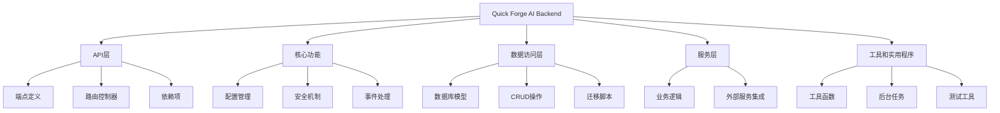
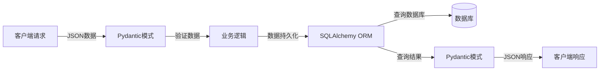
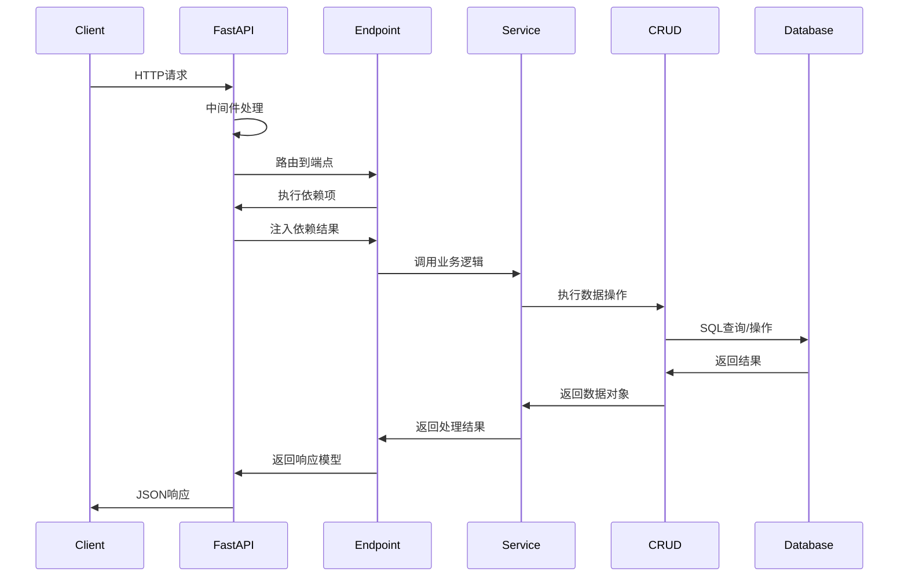

# FastAPI组件和布局

本文档详细介绍Quick Forge AI项目中FastAPI全栈模板的项目结构、关键组件及其组织方式。通过了解这种架构，您可以更好地导航代码库并进行有效的开发。

## 项目结构概览

Quick Forge AI的后端基于FastAPI构建，采用模块化和分层的架构，便于维护和扩展。完整的项目结构如下：



## 目录结构详解

项目的文件系统组织反映了上述架构，主要目录结构如下：

```
app/
├── api/               # API层 - 所有API端点
│   ├── dependencies/  # 可重用的依赖项(认证、权限等)
│   ├── errors/        # 错误处理程序
│   └── routes/        # API路由模块
├── core/              # 核心功能 - 基础设施代码
│   ├── config.py      # 配置管理
│   ├── security.py    # 安全相关功能
│   └── events.py      # 应用事件处理
├── db/                # 数据访问层
│   ├── base.py        # 数据库模型的基类
│   ├── session.py     # 数据库会话管理
│   └── init_db.py     # 数据库初始化逻辑
├── models/            # 数据模型
│   ├── user.py        # 用户数据模型
│   └── item.py        # 项目数据模型
├── schemas/           # Pydantic模式/模型
│   ├── user.py        # 用户相关的API模式
│   └── item.py        # 项目相关的API模式
├── crud/              # CRUD操作
│   ├── base.py        # 基础CRUD功能
│   ├── user.py        # 用户相关的CRUD
│   └── item.py        # 项目相关的CRUD
├── services/          # 服务层 - 业务逻辑
│   ├── user_service.py # 用户相关业务逻辑
│   └── ai_service.py   # AI相关业务逻辑
├── utils/             # 工具和辅助函数
│   ├── logging.py     # 日志工具
│   └── email.py       # 电子邮件功能
├── tests/             # 测试模块
│   ├── api/           # API测试
│   ├── crud/          # CRUD操作测试
│   └── services/      # 服务测试
├── main.py            # 应用入口点
└── celery_worker.py   # Celery工作器（可选）
```

## 核心组件解析

### 1. API层

API层定义了所有HTTP端点，处理输入验证和响应格式化：

```python
# app/api/routes/users.py
from fastapi import APIRouter, Depends, HTTPException
from sqlalchemy.orm import Session

from app.api.dependencies.database import get_db
from app.schemas.user import UserCreate, UserOut
from app.services.user_service import create_new_user

router = APIRouter()

@router.post("/users/", response_model=UserOut)
def create_user(
    user_in: UserCreate, 
    db: Session = Depends(get_db)
):
    """创建新用户"""
    return create_new_user(db=db, user_in=user_in)
```

API路由器在主应用中注册：

```python
# app/main.py部分内容
from fastapi import FastAPI
from app.api.routes import users, auth, items

app = FastAPI(title="Quick Forge AI")

# 包含各种路由器
app.include_router(auth.router, prefix="/api/v1")
app.include_router(users.router, prefix="/api/v1")
app.include_router(items.router, prefix="/api/v1")
```

### 2. 数据模型和模式

项目使用双模型系统：

1. **SQLAlchemy ORM模型**：定义数据库结构
2. **Pydantic模式**：处理数据验证、序列化和文档生成



#### SQLAlchemy模型示例：

```python
# app/models/user.py
from sqlalchemy import Column, Integer, String, Boolean
from sqlalchemy.orm import relationship

from app.db.base_class import Base

class User(Base):
    __tablename__ = "users"
    
    id = Column(Integer, primary_key=True, index=True)
    email = Column(String, unique=True, index=True)
    hashed_password = Column(String)
    is_active = Column(Boolean, default=True)
    is_superuser = Column(Boolean, default=False)
    
    items = relationship("Item", back_populates="owner")
```

#### Pydantic模式示例：

```python
# app/schemas/user.py
from pydantic import BaseModel, EmailStr, validator

class UserBase(BaseModel):
    email: EmailStr
    is_active: bool = True
    is_superuser: bool = False

class UserCreate(UserBase):
    password: str
    
    @validator("password")
    def password_min_length(cls, v):
        if len(v) < 8:
            raise ValueError("密码必须至少包含8个字符")
        return v

class UserOut(UserBase):
    id: int
    
    class Config:
        orm_mode = True
```

### 3. CRUD操作

CRUD操作处理数据库交互的基本功能：

```python
# app/crud/base.py
from typing import Any, Dict, Generic, List, Optional, Type, TypeVar, Union

from fastapi.encoders import jsonable_encoder
from pydantic import BaseModel
from sqlalchemy.orm import Session

from app.db.base_class import Base

ModelType = TypeVar("ModelType", bound=Base)
CreateSchemaType = TypeVar("CreateSchemaType", bound=BaseModel)
UpdateSchemaType = TypeVar("UpdateSchemaType", bound=BaseModel)

class CRUDBase(Generic[ModelType, CreateSchemaType, UpdateSchemaType]):
    def __init__(self, model: Type[ModelType]):
        """
        CRUD对象，包含默认方法用于创建、读取、更新和删除操作。
        """
        self.model = model

    def get(self, db: Session, id: Any) -> Optional[ModelType]:
        return db.query(self.model).filter(self.model.id == id).first()

    def create(self, db: Session, *, obj_in: CreateSchemaType) -> ModelType:
        obj_in_data = jsonable_encoder(obj_in)
        db_obj = self.model(**obj_in_data)
        db.add(db_obj)
        db.commit()
        db.refresh(db_obj)
        return db_obj
```

### 4. 服务层

服务层封装了复杂的业务逻辑：

```python
# app/services/user_service.py
from sqlalchemy.orm import Session
from fastapi import HTTPException, status

from app.crud.user import user as user_crud
from app.schemas.user import UserCreate
from app.core.security import get_password_hash

def create_new_user(db: Session, user_in: UserCreate):
    """
    创建新用户，包含业务逻辑验证
    """
    # 检查邮箱是否已存在
    user = user_crud.get_by_email(db, email=user_in.email)
    if user:
        raise HTTPException(
            status_code=status.HTTP_400_BAD_REQUEST,
            detail="该邮箱已注册"
        )
    
    # 创建新用户
    hashed_password = get_password_hash(user_in.password)
    user_data = user_in.dict(exclude={"password"})
    user_data["hashed_password"] = hashed_password
    
    return user_crud.create(db, obj_in=user_data)
```

### 5. 依赖注入系统

FastAPI的依赖注入系统用于处理共享资源和安全检查：

```python
# app/api/dependencies/database.py
from typing import Generator

from fastapi import Depends, HTTPException, status
from sqlalchemy.orm import Session

from app.db.session import SessionLocal
from app.crud.user import user as user_crud
from app.models.user import User
from app.core.security import verify_access_token

def get_db() -> Generator:
    """
    数据库会话依赖项
    """
    db = SessionLocal()
    try:
        yield db
    finally:
        db.close()

def get_current_user(
    db: Session = Depends(get_db),
    token: str = Depends(verify_access_token)
) -> User:
    """
    获取当前已验证用户
    """
    user = user_crud.get(db, id=token.sub)
    if not user:
        raise HTTPException(
            status_code=status.HTTP_404_NOT_FOUND,
            detail="用户不存在"
        )
    return user
```

## 主要工作流程

下面的图表展示了一个典型API请求的处理流程：



## 最佳实践与设计原则

Quick Forge AI的后端架构遵循以下设计原则：

1. **关注点分离**：API端点、业务逻辑和数据访问分层，便于维护
2. **依赖注入**：使用FastAPI的依赖系统实现松耦合
3. **类型安全**：使用Pydantic和类型提示确保类型安全
4. **模块化**：功能被分组到相关模块中，便于重用和测试
5. **SOLID原则**：特别是单一职责和依赖倒置原则
6. **安全第一**：内置安全机制和最佳实践

## 定制和扩展

要扩展现有功能：

1. **添加新实体**：创建模型、模式和CRUD操作
2. **添加新端点**：在`routes`目录中创建新路由模块
3. **实现新业务逻辑**：在`services`目录中添加服务函数

例如，要添加新的"项目"功能：

1. 创建模型：`app/models/project.py`
2. 定义模式：`app/schemas/project.py`
3. 实现CRUD：`app/crud/project.py`
4. 添加服务：`app/services/project_service.py`
5. 创建API路由：`app/api/routes/projects.py`
6. 在主应用中注册路由

## 结论

Quick Forge AI的FastAPI组件和布局采用现代化、类型安全且可扩展的架构，使开发团队能够快速构建高质量的API。通过遵循这些结构和模式，您可以保持代码库的组织性和一致性，同时支持项目随时间的增长和演变。 