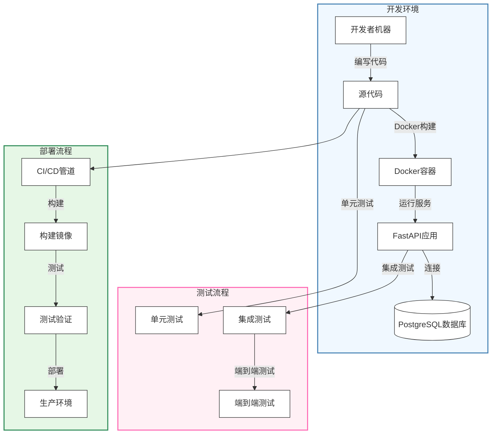
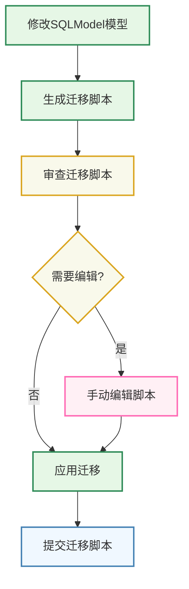

# FastAPI开发流程

本文档介绍了在Quick Forge AI项目中使用FastAPI进行后端开发的完整流程、环境设置和最佳实践。

## 开发环境架构

下图展示了Quick Forge AI后端开发环境的整体架构：



## 环境设置

### 本地开发环境

在开始开发Quick Forge AI后端之前，您需要设置本地开发环境：

1. **安装必要工具**：
   - Python 3.9+
   - Docker 和 Docker Compose
   - Git
   - 代码编辑器（推荐VS Code）

2. **克隆代码库**：
   ```bash
   git clone https://github.com/your-username/quick-forge-ai.git
   cd quick-forge-ai
   ```

3. **设置Python虚拟环境**：
   ```bash
   python -m venv .venv
   source .venv/bin/activate  # 在Windows上使用: .venv\Scripts\activate
   pip install -r requirements.txt
   ```

4. **配置环境变量**：
   - 复制`.env.example`文件为`.env`
   - 根据您的本地设置调整配置值

### Docker开发环境

Quick Forge AI提供了完整的Docker配置，实现一致的开发环境：

1. **使用Docker Compose启动服务**：
   ```bash
   docker-compose up -d
   ```

2. **查看服务日志**：
   ```bash
   docker-compose logs -f backend
   ```

3. **访问FastAPI文档**：
   - Swagger UI: http://localhost:8000/docs
   - ReDoc: http://localhost:8000/redoc

## 开发工作流程

### 1. 理解项目结构

Quick Forge AI后端遵循模块化结构：

```
backend/
├── app/
│   ├── api/             # API端点和路由
│   │   ├── deps.py      # 依赖注入
│   │   └── routes/      # API路由模块
│   ├── core/            # 核心配置
│   │   ├── config.py    # 应用设置
│   │   └── security.py  # 安全工具
│   ├── db/              # 数据库
│   │   ├── base.py      # 基础模型
│   │   ├── session.py   # 数据库会话
│   │   └── models/      # 数据库模型
│   ├── services/        # 业务逻辑
│   ├── utils/           # 工具函数
│   └── main.py          # 应用入口点
├── tests/               # 测试模块
├── alembic/             # 数据库迁移
│   └── versions/        # 迁移脚本
├── docker/              # Docker配置
└── pyproject.toml       # 项目依赖
```

### 2. 功能开发流程

开发新功能时遵循以下流程：


#### 详细步骤说明

1. **创建新分支**：
   ```bash
   git checkout -b feature/new-feature-name
   ```

2. **定义数据模型**：
   - 在`app/db/models/`中使用SQLModel创建新模型
   - 遵循项目现有模型的命名和结构约定

3. **创建数据库迁移**：
   ```bash
   alembic revision --autogenerate -m "Add new model"
   alembic upgrade head
   ```

4. **实现业务逻辑**：
   - 在`app/services/`中创建或扩展服务模块
   - 实现业务规则和数据处理逻辑

5. **创建API端点**：
   - 在`app/api/routes/`中添加新的API路由
   - 在`app/api/api.py`中注册路由

6. **编写测试**：
   - 为新功能编写单元测试和集成测试
   - 运行测试确保功能正常工作：
     ```bash
     pytest tests/
     ```

7. **提交变更**：
   ```bash
   git add .
   git commit -m "Add feature: description of changes"
   git push origin feature/new-feature-name
   ```

8. **创建合并请求**：
   - 在GitHub/GitLab上创建合并请求
   - 请求代码审查并处理反馈

### 3. 数据库迁移工作流

数据库架构更改时遵循以下流程：



#### 处理数据库迁移

```bash
# 生成迁移脚本
alembic revision --autogenerate -m "描述架构更改"

# 检查生成的脚本
# 脚本位于 alembic/versions/ 目录

# 应用迁移
alembic upgrade head

# 回滚迁移（如需）
alembic downgrade -1
```

## Docker开发环境

Quick Forge AI使用Docker Compose管理开发环境，包括FastAPI后端和PostgreSQL数据库。

### Docker Compose配置

```yaml
version: '3.8'

services:
  backend:
    build:
      context: .
      dockerfile: Dockerfile
    ports:
      - "8000:8000"
    volumes:
      - ./:/app
    environment:
      - DATABASE_URL=postgresql://postgres:postgres@db:5432/app
      - SECRET_KEY=${SECRET_KEY}
      - ENVIRONMENT=development
    depends_on:
      - db
    command: uvicorn app.main:app --host 0.0.0.0 --port 8000 --reload

  db:
    image: postgres:14
    volumes:
      - postgres_data:/var/lib/postgresql/data
    environment:
      - POSTGRES_USER=postgres
      - POSTGRES_PASSWORD=postgres
      - POSTGRES_DB=app
    ports:
      - "5432:5432"

volumes:
  postgres_data:
```

### Dockerfile

```dockerfile
FROM python:3.9

WORKDIR /app

COPY requirements.txt .
RUN pip install --no-cache-dir -r requirements.txt

COPY . .

CMD ["uvicorn", "app.main:app", "--host", "0.0.0.0", "--port", "8000"]
```

## 测试策略

### 测试类型

Quick Forge AI实施了全面的测试策略：

1. **单元测试**：
   - 测试独立组件和函数
   - 使用pytest和pytest-mock

2. **集成测试**：
   - 测试组件之间的交互
   - 使用FastAPI的TestClient和测试数据库

3. **端到端测试**：
   - 测试完整的用户流程
   - 使用真实数据库和API调用

### 运行测试

```bash
# 运行所有测试
pytest

# 运行特定测试文件
pytest tests/api/test_users.py

# 运行覆盖率报告
pytest --cov=app tests/
```

## 生产部署

Quick Forge AI使用Docker进行生产部署，遵循以下最佳实践：

1. **环境变量**：
   - 所有配置通过环境变量传入
   - 生产中使用安全的密钥管理解决方案

2. **数据库迁移**：
   - 部署前自动应用迁移
   - 支持回滚机制

3. **健康检查**：
   - `/health`端点用于监控
   - 实现就绪和存活探针

4. **日志**：
   - 结构化JSON日志
   - 与集中式日志系统集成

5. **安全最佳实践**：
   - 强化Docker容器
   - 定期依赖项更新
   - 实施CORS和安全头

## 故障排除

### 常见问题及解决方案

1. **数据库连接问题**：
   ```
   错误: 无法连接到数据库
   解决方案: 
   - 检查DATABASE_URL环境变量
   - 确认数据库服务正在运行
   - 验证网络连接和防火墙设置
   ```

2. **迁移错误**：
   ```
   错误: 表已存在或列不匹配
   解决方案:
   - 检查alembic版本历史
   - 在测试环境中测试迁移
   - 对于严重问题，考虑重置测试数据库
   ```

3. **Docker相关问题**：
   ```
   错误: 无法构建或启动容器
   解决方案:
   - 检查Docker和Docker Compose安装
   - 验证Dockerfile和docker-compose.yml
   - 确保端口未被占用
   ```

## 性能优化

### 数据库优化

1. **查询优化**：
   - 使用适当的索引
   - 实现分页和限制结果数量
   - 利用SQLAlchemy的关系加载策略

2. **连接池**：
   - 配置适当的连接池大小
   - 监控数据库连接使用情况

### API性能

1. **缓存策略**：
   - 实现Redis缓存
   - 缓存频繁访问的数据

2. **异步处理**：
   - 利用FastAPI的异步功能
   - 使用后台任务处理长时间运行的操作

## 参考资源

- [FastAPI官方文档](https://fastapi.tiangolo.com/)
- [SQLModel文档](https://sqlmodel.tiangolo.com/)
- [Alembic文档](https://alembic.sqlalchemy.org/)
- [Docker Compose文档](https://docs.docker.com/compose/)
- [Pytest文档](https://docs.pytest.org/) 