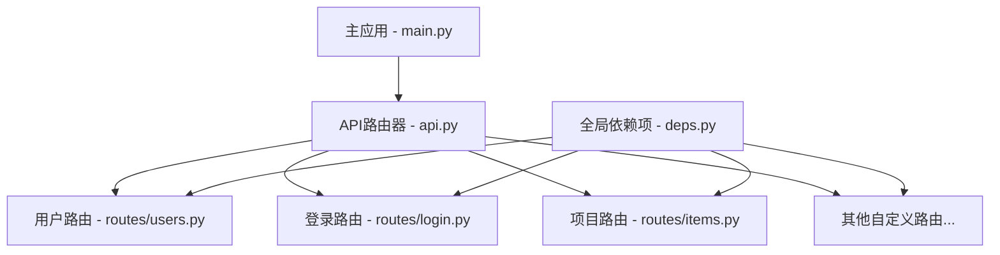

# FastAPI API端点和路由

本文档详细描述FastAPI全栈模板中的API端点和路由设计。它涵盖了如何组织路由、创建端点、管理依赖项注入以及处理请求和响应。

## API结构概述

FastAPI全栈模板使用一种分层设计来组织API端点：



这种结构将相关端点分组到专用模块中，使代码保持组织良好且可维护。

## 路由组织

### 主应用入口点

主应用在`main.py`中定义，它装载所有API路由：

```python
app = FastAPI(
    title=settings.PROJECT_NAME,
    description="FastAPI全栈应用API",
    openapi_url=f"{settings.API_V1_STR}/openapi.json",
)

app.include_router(api_router, prefix=settings.API_V1_STR)
```

### API路由器

中央API路由器在`app/api/api.py`中定义，它聚合所有功能特定的路由器：

```python
api_router = APIRouter()
api_router.include_router(login.router, tags=["login"])
api_router.include_router(users.router, prefix="/users", tags=["users"])
api_router.include_router(items.router, prefix="/items", tags=["items"])
```

### 功能特定路由器

每个功能区域有自己的路由模块，例如`app/api/routes/users.py`：

```python
router = APIRouter()

@router.get("/", response_model=List[User])
def read_users(
    db: Session = Depends(deps.get_db),
    skip: int = 0,
    limit: int = 100,
    current_user: User = Depends(deps.get_current_active_superuser),
) -> Any:
    """
    获取所有用户。
    """
    users = crud.user.get_multi(db, skip=skip, limit=limit)
    return users
```

## API版本控制

API版本通过URL前缀实现。默认版本前缀定义在`app/core/config.py`中：

```python
API_V1_STR = "/api/v1"
```

这确保所有API端点都带有`/api/v1/`前缀，例如`/api/v1/users/`。当需要引入突破性变更时，可以创建新的版本`/api/v2/`，同时保持旧端点继续工作。

## 端点设计

### 路径操作装饰器

FastAPI通过路径操作装饰器定义端点，例如：

```python
@router.get(...)    # 读取资源
@router.post(...)   # 创建资源
@router.put(...)    # 完全更新资源
@router.patch(...)  # 部分更新资源
@router.delete(...) # 删除资源
```

### 响应模型

响应被明确类型化，确保API返回预期格式的数据：

```python
@router.get("/me", response_model=User)
def read_user_me(
    current_user: User = Depends(deps.get_current_active_user),
) -> Any:
    """
    获取当前用户。
    """
    return current_user
```

### 状态码

可以自定义状态码，使其与HTTP语义一致：

```python
@router.post("/", response_model=User, status_code=201)
def create_user(
    *,
    db: Session = Depends(deps.get_db),
    user_in: UserCreate,
    current_user: User = Depends(deps.get_current_active_superuser),
) -> Any:
    """
    创建新用户。
    """
    # ...创建用户逻辑...
    return user
```

## 依赖注入系统

FastAPI的依赖注入系统在`app/api/deps.py`中集中定义，用于：

1. 数据库会话管理
2. 用户认证和授权
3. 共享功能

```python
# 获取数据库会话
def get_db() -> Generator:
    try:
        db = SessionLocal()
        yield db
    finally:
        db.close()

# 获取当前用户
def get_current_user(...) -> User:
    # ...认证逻辑...
    return user

# 检查用户权限
def get_current_active_user(...) -> User:
    # ...检查用户是否活跃...
    return current_user
```

### 路径和查询参数

路径和查询参数直接声明为函数参数：

```python
@router.get("/items/{item_id}")
def read_item(
    item_id: UUID,
    q: Optional[str] = None,
    skip: int = 0,
    limit: int = 100,
    current_user: User = Depends(deps.get_current_active_user),
) -> Any:
    """
    获取指定的项目。
    """
    # ...获取项目逻辑...
    return item
```

## 请求验证

### Pydantic模型验证

Pydantic模型用于验证请求体数据：

```python
@router.post("/", response_model=Item)
def create_item(
    *,
    db: Session = Depends(deps.get_db),
    item_in: ItemCreate,
    current_user: User = Depends(deps.get_current_active_user),
) -> Any:
    """
    创建新项目。
    """
    item = crud.item.create_with_owner(
        db=db, obj_in=item_in, owner_id=current_user.id
    )
    return item
```

当请求体不匹配`ItemCreate`模型时，FastAPI会自动返回一个适当的错误响应。

### 复杂验证

可以添加更复杂的验证和处理逻辑：

```python
@router.put("/{item_id}", response_model=Item)
def update_item(
    *,
    db: Session = Depends(deps.get_db),
    item_id: UUID,
    item_in: ItemUpdate,
    current_user: User = Depends(deps.get_current_active_user),
) -> Any:
    """
    更新项目。
    """
    item = crud.item.get(db=db, id=item_id)
    if not item:
        raise HTTPException(status_code=404, detail="项目未找到")
    if item.owner_id != current_user.id and not current_user.is_superuser:
        raise HTTPException(status_code=403, detail="没有足够的权限")
    
    item = crud.item.update(db=db, db_obj=item, obj_in=item_in)
    return item
```

## API文档

FastAPI自动生成交互式API文档，可在以下位置访问：

- Swagger UI: `/docs`
- ReDoc: `/redoc`

自动文档使用OpenAPI标准，并包括：
- 所有端点描述
- 参数说明
- 请求体架构
- 可能的响应
- 授权要求

## 错误处理

### HTTP异常

使用FastAPI的`HTTPException`处理错误情况：

```python
@router.get("/{item_id}", response_model=Item)
def read_item(
    *,
    db: Session = Depends(deps.get_db),
    item_id: UUID,
    current_user: User = Depends(deps.get_current_active_user),
) -> Any:
    """
    获取单个项目。
    """
    item = crud.item.get(db=db, id=item_id)
    if not item:
        raise HTTPException(status_code=404, detail="项目未找到")
    if item.owner_id != current_user.id and not current_user.is_superuser:
        raise HTTPException(status_code=403, detail="没有足够的权限")
    return item
```

### 全局异常处理

可以添加全局异常处理器：

```python
@app.exception_handler(RequestValidationError)
async def validation_exception_handler(request, exc):
    return JSONResponse(
        status_code=status.HTTP_422_UNPROCESSABLE_ENTITY,
        content={"detail": exc.errors()},
    )
```

## 分页

API实现了标准的偏移/限制分页：

```python
@router.get("/", response_model=List[Item])
def read_items(
    db: Session = Depends(deps.get_db),
    skip: int = 0,
    limit: int = 100,
    current_user: User = Depends(deps.get_current_active_user),
) -> Any:
    """
    获取所有项目。
    """
    if current_user.is_superuser:
        items = crud.item.get_multi(db, skip=skip, limit=limit)
    else:
        items = crud.item.get_multi_by_owner(
            db=db, owner_id=current_user.id, skip=skip, limit=limit
        )
    return items
```

## 后台任务

FastAPI支持异步后台任务处理，例如发送邮件：

```python
@router.post("/password-recovery/{email}")
def recover_password(
    email: str,
    background_tasks: BackgroundTasks,
    db: Session = Depends(deps.get_db),
) -> Any:
    """
    密码恢复。
    """
    user = crud.user.get_by_email(db, email=email)
    if not user:
        raise HTTPException(
            status_code=404,
            detail="此电子邮件的用户不存在",
        )
    
    password_reset_token = generate_password_reset_token(email=email)
    
    # 添加发送电子邮件的后台任务
    background_tasks.add_task(
        send_reset_password_email,
        email_to=user.email,
        email=email,
        token=password_reset_token,
    )
    
    return {"msg": "密码恢复电子邮件已发送"}
```

## 扩展API

### 添加新路由器

创建新的功能路由器：

```python
# app/api/routes/my_feature.py
from fastapi import APIRouter, Depends, HTTPException
from sqlmodel import Session, select
from app.api import deps
from app.models import MyModel, MyModelCreate

router = APIRouter()

@router.post("/", response_model=MyModel)
def create_my_model(
    *,
    db: Session = Depends(deps.get_db),
    my_model_in: MyModelCreate,
    current_user: User = Depends(deps.get_current_active_user),
) -> Any:
    """
    创建新模型。
    """
    my_model = MyModel.from_orm(my_model_in)
    my_model.owner_id = current_user.id
    db.add(my_model)
    db.commit()
    db.refresh(my_model)
    return my_model
```

在`app/api/api.py`中注册新路由器：

```python
from app.api.routes import my_feature

api_router.include_router(
    my_feature.router,
    prefix="/my-feature",
    tags=["my-feature"]
)
```

### 高级搜索和过滤

实现搜索功能：

```python
@router.get("/search/", response_model=List[MyModel])
def search_my_models(
    *,
    db: Session = Depends(deps.get_db),
    keyword: Optional[str] = None,
    category: Optional[str] = None,
    skip: int = 0,
    limit: int = 100,
    current_user: User = Depends(deps.get_current_active_user),
) -> Any:
    """
    搜索模型。
    """
    query = select(MyModel)
    
    # 应用各种过滤条件
    if keyword:
        query = query.where(
            MyModel.name.contains(keyword) | 
            MyModel.description.contains(keyword)
        )
    if category:
        query = query.where(MyModel.category == category)
        
    # 设置所有者过滤，除非是超级用户
    if not current_user.is_superuser:
        query = query.where(MyModel.owner_id == current_user.id)
        
    query = query.offset(skip).limit(limit)
    return db.exec(query).all()
```

## 最佳实践

### 路由组织

- 将相关端点分组到专门的路由器中
- 使用有意义的前缀和标签
- 保持路由器专注于特定功能领域

### 端点设计

- 使用合适的HTTP方法 (GET, POST, PUT, DELETE)
- 明确指定响应模型
- 使用适当的状态码
- 提供有意义的错误消息

### 依赖注入

- 集中定义共享依赖项
- 避免依赖项之间的循环依赖
- 使用依赖项来复用认证和授权逻辑

### 安全性

- 为所有需要保护的端点添加认证依赖项
- 实施基于角色的访问控制
- 验证所有用户输入
- 防止过度请求（限速）

### 性能

- 使用异步操作处理I/O绑定任务
- 实施缓存以减少数据库访问
- 限制查询结果大小
- 使用索引优化数据库查询 