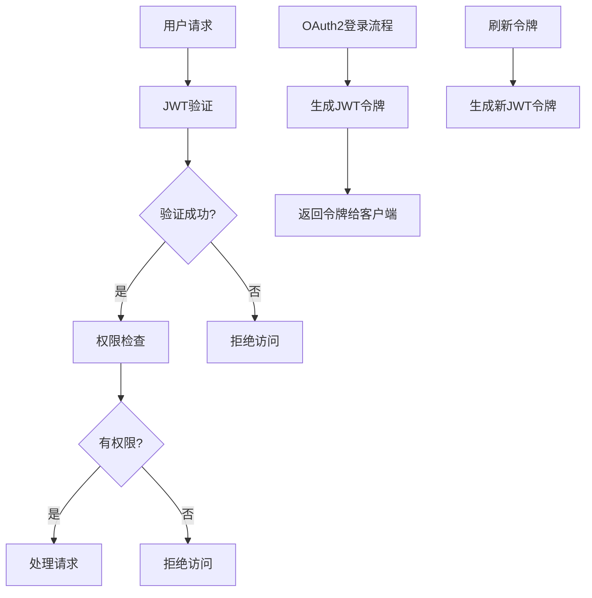
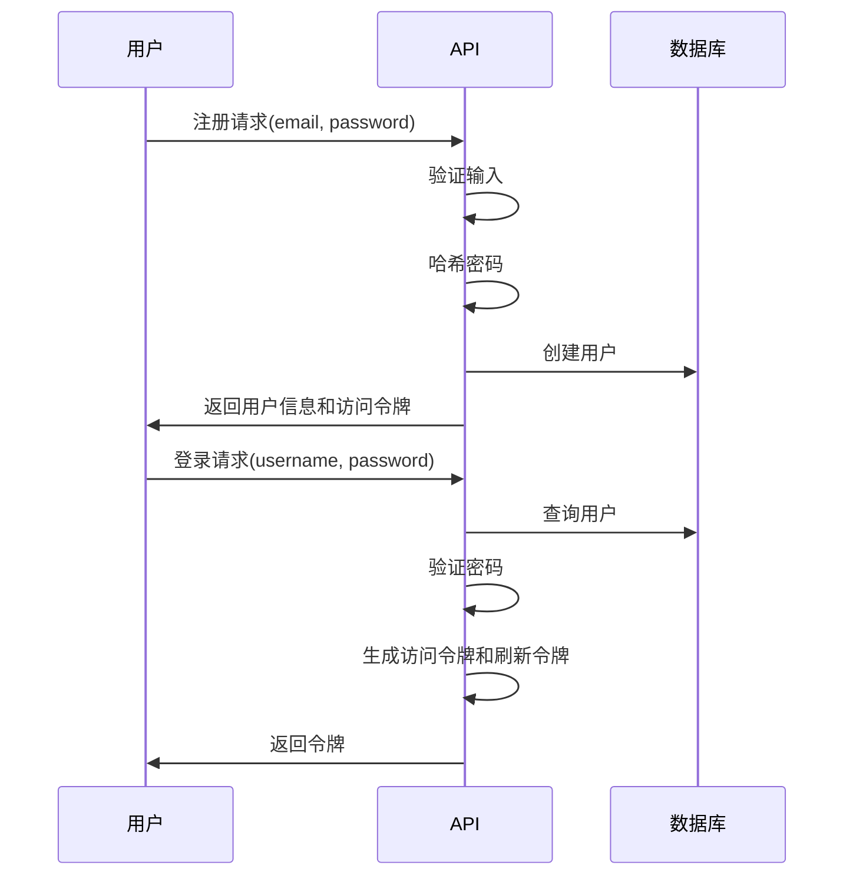
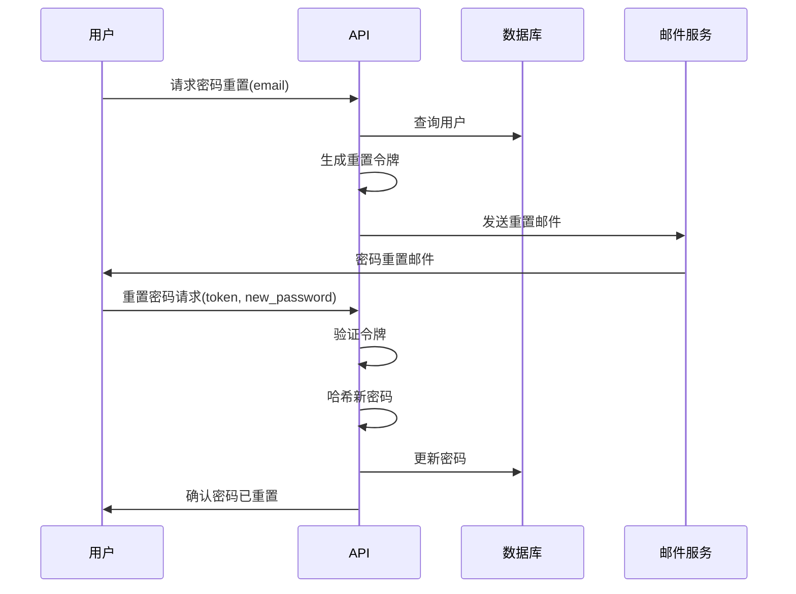

# FastAPI认证和安全

本文档详细介绍FastAPI全栈模板中的认证机制、安全策略和用户管理系统。它涵盖了JWT令牌、OAuth2流程、密码哈希以及API防护措施等内容。

## 安全技术栈概述

该模板使用以下安全技术栈：

* **JWT (JSON Web Tokens)**：用于无状态身份验证
* **OAuth2**：带密码流程的标准授权框架
* **密码哈希**：使用Bcrypt算法安全存储用户密码
* **HTTPS**：在生产环境中通过Traefik自动配置TLS
* **CORS (跨源资源共享)**：限制哪些源可以访问API



## 认证流程

### 用户注册与登录

系统提供完整的用户管理功能，包括注册、登录、密码重置等：



### 令牌认证

系统使用两种令牌类型：

1. **访问令牌 (JWT)**：短期有效(默认120分钟)，用于API访问
2. **刷新令牌**：长期有效(默认30天)，用于重新获取访问令牌

当访问令牌过期时，客户端使用刷新令牌获取新的访问令牌，无需再次输入凭据。

## 安全实现

### JWT配置

JWT的配置在`app/core/security.py`中定义：

```python
# 生成JWT令牌
def create_access_token(subject: Union[str, Any], expires_delta: timedelta = None) -> str:
    if expires_delta:
        expire = datetime.utcnow() + expires_delta
    else:
        expire = datetime.utcnow() + timedelta(
            minutes=settings.ACCESS_TOKEN_EXPIRE_MINUTES
        )
    to_encode = {"exp": expire, "sub": str(subject)}
    encoded_jwt = jwt.encode(to_encode, settings.SECRET_KEY, algorithm=settings.ALGORITHM)
    return encoded_jwt

# 验证JWT令牌
def verify_token(token: str) -> dict:
    try:
        payload = jwt.decode(
            token, settings.SECRET_KEY, algorithms=[settings.ALGORITHM]
        )
        return payload
    except JWTError:
        raise credentials_exception
```

### 密码哈希

用户密码使用Bcrypt进行哈希处理，确保即使数据库被泄露，密码也不会被轻易获取：

```python
def get_password_hash(password: str) -> str:
    return pwd_context.hash(password)

def verify_password(plain_password: str, hashed_password: str) -> bool:
    return pwd_context.verify(plain_password, hashed_password)
```

### 依赖注入安全层

FastAPI的依赖注入系统被广泛用于实现安全层，位于`app/api/deps.py`：

```python
# 获取当前用户
def get_current_user(
    db: Session = Depends(get_db), token: str = Depends(oauth2_scheme)
) -> User:
    try:
        payload = jwt.decode(
            token, settings.SECRET_KEY, algorithms=[settings.ALGORITHM]
        )
        token_data = TokenPayload(**payload)
    except (JWTError, ValidationError):
        raise HTTPException(
            status_code=status.HTTP_403_FORBIDDEN,
            detail="无法验证凭据",
        )
    user = crud.user.get(db, id=token_data.sub)
    if not user:
        raise HTTPException(status_code=404, detail="用户不存在")
    return user

# 获取当前活跃用户
def get_current_active_user(
    current_user: User = Depends(get_current_user),
) -> User:
    if not current_user.is_active:
        raise HTTPException(status_code=400, detail="用户未激活")
    return current_user

# 获取当前超级用户
def get_current_active_superuser(
    current_user: User = Depends(get_current_user),
) -> User:
    if not current_user.is_superuser:
        raise HTTPException(
            status_code=400, detail="用户权限不足"
        )
    return current_user
```

## OAuth2实现

模板使用OAuth2密码流进行身份验证，流程如下：

### 登录路由

```python
@router.post("/login/access-token", response_model=Token)
def login_access_token(
    db: Session = Depends(deps.get_db), form_data: OAuth2PasswordRequestForm = Depends()
) -> Any:
    """
    OAuth2 兼容的令牌登录，获取访问令牌供未来请求使用
    """
    user = crud.user.authenticate(
        db, email=form_data.username, password=form_data.password
    )
    if not user:
        raise HTTPException(status_code=400, detail="邮箱或密码不正确")
    elif not crud.user.is_active(user):
        raise HTTPException(status_code=400, detail="用户未激活")
    access_token_expires = timedelta(minutes=settings.ACCESS_TOKEN_EXPIRE_MINUTES)
    return {
        "access_token": security.create_access_token(
            user.id, expires_delta=access_token_expires
        ),
        "token_type": "bearer",
    }
```

### 令牌刷新

```python
@router.post("/login/refresh-token", response_model=Token)
def refresh_token(
    db: Session = Depends(deps.get_db),
    refresh_token: str = Body(...),
) -> Any:
    """
    使用刷新令牌获取新的访问令牌
    """
    try:
        payload = jwt.decode(
            refresh_token, settings.SECRET_KEY, algorithms=[settings.ALGORITHM]
        )
        token_data = TokenPayload(**payload)
    except (JWTError, ValidationError):
        raise HTTPException(
            status_code=status.HTTP_403_FORBIDDEN,
            detail="无效的刷新令牌",
        )
    user = crud.user.get(db, id=token_data.sub)
    if not user:
        raise HTTPException(status_code=404, detail="用户不存在")
    if not user.is_active:
        raise HTTPException(status_code=400, detail="用户未激活")
    access_token_expires = timedelta(minutes=settings.ACCESS_TOKEN_EXPIRE_MINUTES)
    return {
        "access_token": security.create_access_token(
            user.id, expires_delta=access_token_expires
        ),
        "token_type": "bearer",
    }
```

## 密码重置流程

系统提供完整的密码重置功能：



## CORS安全配置

CORS配置通过环境变量控制，可以限制哪些域可以访问API：

```python
# 应用中的CORS设置
app.add_middleware(
    CORSMiddleware,
    allow_origins=[str(origin) for origin in settings.BACKEND_CORS_ORIGINS],
    allow_credentials=True,
    allow_methods=["*"],
    allow_headers=["*"],
)
```

## 最佳安全实践

FastAPI模板中内置了多项安全最佳实践：

1. **环境变量隔离**：敏感配置通过环境变量或.env文件提供，不保存在代码中
2. **安全随机密钥**：自动生成安全的随机密钥
3. **密码策略**：强制实施密码强度要求(最小8个字符)
4. **令牌到期**：访问令牌有合理的过期时间
5. **HTTPS默认启用**：在生产环境中通过Traefik自动配置HTTPS
6. **防止CSRF**：使用Bearer令牌认证防止CSRF攻击
7. **降低暴力攻击风险**：登录失败不显示具体错误原因

## 自定义认证扩展

可以通过以下方式扩展认证系统：

### 基于角色的访问控制

```python
# 扩展User模型
class User(UserBase, table=True):
    # 现有字段...
    role: str = Field(default="user")  # 可以是 "user", "admin", "manager" 等

# 创建角色检查依赖
def get_current_admin_user(
    current_user: User = Depends(deps.get_current_active_user),
) -> User:
    if current_user.role != "admin":
        raise HTTPException(
            status_code=status.HTTP_403_FORBIDDEN,
            detail="权限不足",
        )
    return current_user
```

### 第三方OAuth集成

```python
# 添加到auth.py
@router.get("/login/google")
async def login_google():
    # 实现Google OAuth登录逻辑
    ...

@router.get("/login/github")
async def login_github():
    # 实现GitHub OAuth登录逻辑
    ...
```

### 双因素认证(2FA)

可以添加双因素认证支持，增强安全性：

```python
# 为User模型添加2FA字段
class User(UserBase, table=True):
    # 现有字段...
    totp_secret: Optional[str] = Field(default=None)
    totp_enabled: bool = Field(default=False)

# 添加2FA验证路由
@router.post("/2fa/verify")
def verify_2fa(
    db: Session = Depends(deps.get_db),
    token: str = Body(...),
    current_user: User = Depends(deps.get_current_active_user),
) -> Any:
    if not current_user.totp_enabled:
        raise HTTPException(status_code=400, detail="用户未启用2FA")
    
    if not verify_totp(current_user.totp_secret, token):
        raise HTTPException(status_code=400, detail="无效的2FA令牌")
    
    return {"msg": "2FA验证成功"}
```

## 安全最佳实践和建议

在扩展和定制模板时，请遵循以下安全建议：

1. **保持依赖项更新**：定期更新依赖项以修复安全漏洞
2. **输入验证**：始终验证所有用户输入
3. **限制请求频率**：实施速率限制防止暴力攻击
4. **安全日志**：记录安全事件但避免记录敏感数据
5. **定期安全审计**：定期检查代码和依赖项的安全漏洞
6. **遵循最小权限原则**：用户和服务只授予最少所需权限 