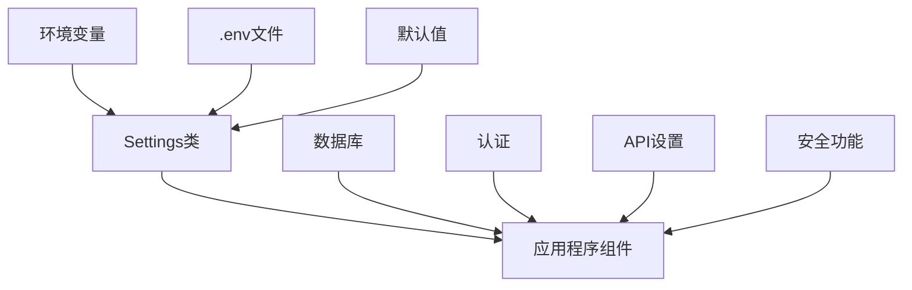
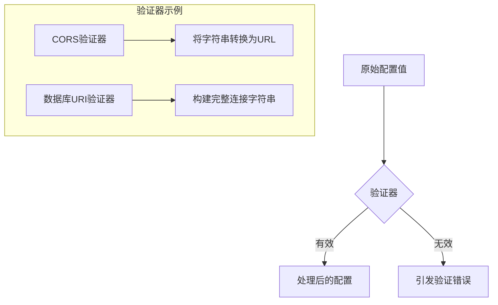

# FastAPI配置系统

本文档介绍FastAPI全栈模板的配置系统、环境变量管理和设置结构。它详细说明了如何管理不同环境的配置，以及如何使用基于Pydantic的设置模型来确保类型安全的配置。

## 配置架构概述

该模板使用基于Pydantic模型的强类型配置系统，它提供了以下优势：

* **类型安全**：所有配置都有明确的类型验证
* **环境变量集成**：自动从环境变量加载配置
* **分层设置**：基于环境的配置继承
* **默认值**：为可选配置提供合理的默认值
* **文档化配置**：所有设置都带有描述性注释

配置系统由以下主要组件组成：



## 配置文件结构

配置系统主要定义在`app/core/config.py`文件中，使用Pydantic的`BaseSettings`类创建一个类型安全的配置模型：

```python
from pydantic import AnyHttpUrl, BaseSettings, EmailStr, validator
from typing import List, Optional, Union

class Settings(BaseSettings):
    # 基础配置
    API_V1_STR: str = "/api/v1"
    SECRET_KEY: str
    # 令牌设置
    ACCESS_TOKEN_EXPIRE_MINUTES: int = 30
    # 服务器设置
    SERVER_NAME: str
    SERVER_HOST: AnyHttpUrl
    BACKEND_CORS_ORIGINS: List[AnyHttpUrl] = []
    # 数据库设置
    POSTGRES_SERVER: str
    POSTGRES_USER: str
    POSTGRES_PASSWORD: str
    POSTGRES_DB: str
    SQLALCHEMY_DATABASE_URI: Optional[str] = None
    # 邮件设置  
    SMTP_TLS: bool = True
    SMTP_PORT: Optional[int] = None
    SMTP_HOST: Optional[str] = None
    SMTP_USER: Optional[str] = None
    SMTP_PASSWORD: Optional[str] = None
    EMAILS_FROM_EMAIL: Optional[EmailStr] = None
    EMAILS_FROM_NAME: Optional[str] = None
    # 超级用户设置
    FIRST_SUPERUSER: EmailStr
    FIRST_SUPERUSER_PASSWORD: str
    USERS_OPEN_REGISTRATION: bool = False
    
    class Config:
        case_sensitive = True
        env_file = ".env"
```

## 环境变量管理

模板使用`.env`文件存储环境特定的配置，这些变量会被自动加载到`Settings`类中：

```
# 该文件应该放在.gitignore中，不进行版本控制

# API配置
API_V1_STR=/api/v1
SECRET_KEY=your-secret-key-here
ACCESS_TOKEN_EXPIRE_MINUTES=30

# 服务器配置
SERVER_NAME=FastAPI App
SERVER_HOST=http://localhost
BACKEND_CORS_ORIGINS=["http://localhost:3000","http://localhost:8000"]

# PostgreSQL数据库配置
POSTGRES_SERVER=db
POSTGRES_USER=postgres
POSTGRES_PASSWORD=postgres
POSTGRES_DB=app

# 邮件配置
SMTP_TLS=True
SMTP_PORT=587
SMTP_HOST=smtp.example.com
SMTP_USER=admin@example.com
SMTP_PASSWORD=password
EMAILS_FROM_EMAIL=info@example.com
EMAILS_FROM_NAME=Example FastAPI App

# 初始超级用户
FIRST_SUPERUSER=admin@example.com
FIRST_SUPERUSER_PASSWORD=admin
USERS_OPEN_REGISTRATION=False
```

## 配置验证器

设置类包含验证器，确保配置值符合预期格式：



### CORS配置验证

```python
@validator("BACKEND_CORS_ORIGINS", pre=True)
def assemble_cors_origins(cls, v: Union[str, List[str]]) -> Union[List[str], str]:
    if isinstance(v, str) and not v.startswith("["):
        return [i.strip() for i in v.split(",")]
    elif isinstance(v, (list, str)):
        return v
    raise ValueError(v)
```

### 数据库URI构建

```python
@validator("SQLALCHEMY_DATABASE_URI", pre=True)
def assemble_db_connection(cls, v: Optional[str], values: dict[str, Any]) -> Any:
    if isinstance(v, str):
        return v
    return PostgresDsn.build(
        scheme="postgresql",
        user=values.get("POSTGRES_USER"),
        password=values.get("POSTGRES_PASSWORD"),
        host=values.get("POSTGRES_SERVER"),
        path=f"/{values.get('POSTGRES_DB') or ''}",
    )
```

## 不同环境的配置管理

模板支持多种环境配置，可通过不同的`.env`文件实现：

| 环境 | 配置文件 | 用途 |
| --- | --- | --- |
| 开发环境 | `.env` | 本地开发使用的配置 |
| 测试环境 | `.env.test` | 用于自动化测试的配置 |
| 生产环境 | 环境变量 | 直接在容器或服务器上设置 |

### 测试环境示例

```
# 测试环境配置

# 使用SQLite内存数据库进行测试
SQLALCHEMY_DATABASE_URI=sqlite:///./test.db

# 禁用邮件发送
SMTP_HOST=
```

## 配置的使用模式

模板全局提供单例设置实例，可在应用的任何部分访问：

```python
# 在config.py底部创建设置实例
settings = Settings()
```

然后在代码中使用：

```python
from app.core.config import settings

# 在FastAPI应用中使用
app = FastAPI(
    title=settings.SERVER_NAME,
    openapi_url=f"{settings.API_V1_STR}/openapi.json",
)

# 在数据库配置中使用
engine = create_engine(str(settings.SQLALCHEMY_DATABASE_URI))

# 在安全功能中使用
pwd_context = CryptContext(schemes=["bcrypt"], deprecated="auto")
SECRET_KEY = settings.SECRET_KEY
```

## 配置最佳实践

1. **密码和敏感信息**：
   - 开发环境：使用`.env`文件（加入`.gitignore`）
   - 生产环境：使用环境变量或安全的密钥管理服务

2. **配置分离**：
   - 应用程序逻辑与配置分离
   - 避免在代码中硬编码任何配置值

3. **验证与默认值**：
   - 提供明确的类型注解和验证规则
   - 为可选配置提供合理的默认值

4. **文档化**：
   - 为每个配置项添加清晰的注释
   - 提供示例`.env.example`文件

遵循这些实践可确保配置管理既安全又灵活，适应不同的部署环境。 