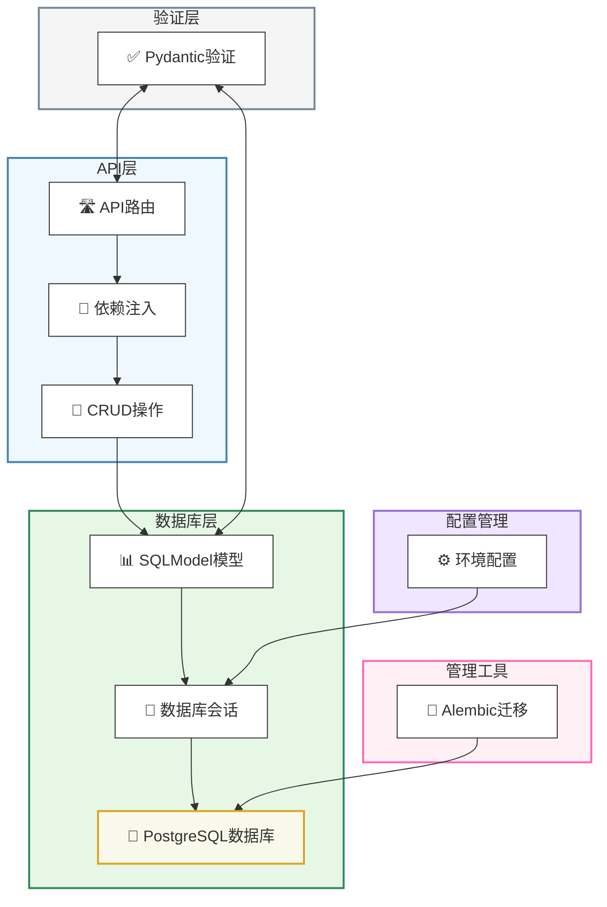
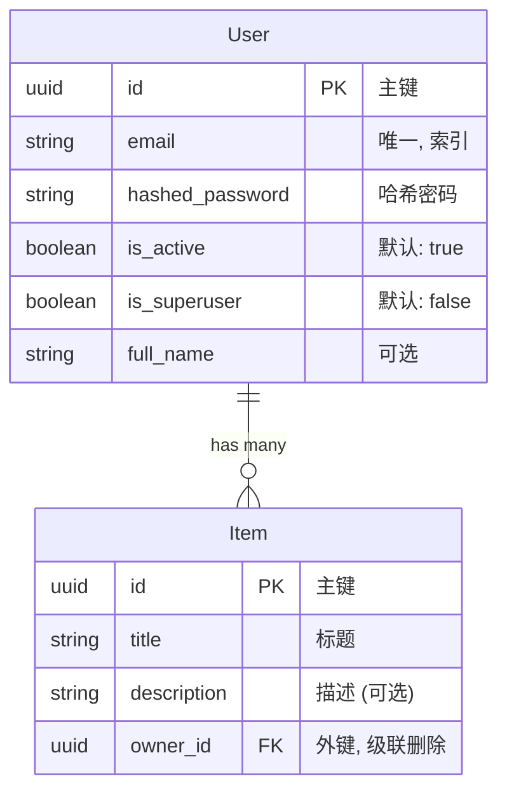
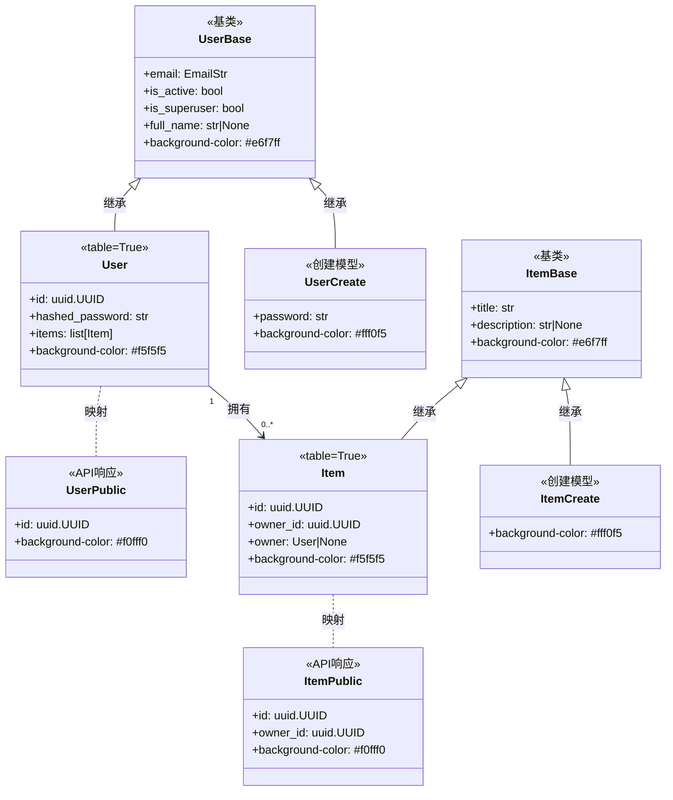

# FastAPI模型和数据库

本文档描述了FastAPI全栈模板中使用的数据库模型、配置和迁移系统。它涵盖了SQLModel如何用于定义数据库架构和API数据结构、PostgreSQL配置以及Alembic如何处理数据库迁移。

## 数据库技术栈概述

该模板使用以下数据库技术栈：

* **PostgreSQL**：主要关系型数据库
* **SQLModel**：ORM（对象关系映射）库，结合了SQLAlchemy Core和Pydantic
* **Alembic**：数据库迁移工具
* **Psycopg**：Python的PostgreSQL适配器



## 数据模型

应用程序使用SQLModel定义其数据模型。SQLModel结合了Pydantic的验证功能和SQLAlchemy的数据库ORM功能，使模型既可以作为数据库架构定义，又可以作为API数据结构。

### 实体关系图



### 模型结构和继承

模板使用分层模型结构，将数据库表、API输入验证和API输出架构的关注点分开：



## 模型类型和模式

应用程序为每个实体遵循结构化模式，具有不同类型的模型，用于不同目的：

| 模型类型 | 用途 | 示例 |
| --- | --- | --- |
| 基础模型 | 定义通用属性 | `UserBase`, `ItemBase` |
| 表模型 | 定义数据库表（使用`table=True`） | `User`, `Item` |
| 创建模型 | 验证创建操作的数据 | `UserCreate`, `UserRegister`, `ItemCreate` |
| 更新模型 | 验证更新操作的数据 | `UserUpdate`, `ItemUpdate` |
| 公共模型 | 格式化API返回的响应数据 | `UserPublic`, `ItemPublic` |
| 集合模型 | 格式化带分页的列表响应 | `UsersPublic`, `ItemsPublic` |

### 用户模型

用户模型包括：

- UserBase（通用字段）
- UserCreate（带密码的创建）
- User（数据库表）
- UserPublic（API响应）
- UserUpdate（管理员更新）
- UsersPublic（分页列表）
- UserRegister（公开注册）
- UserUpdateMe（自助服务更新）

### 项目模型

项目模型包括：

- ItemBase（通用字段）
- ItemCreate（创建）
- Item（数据库表）
- ItemPublic（API响应）
- ItemUpdate（更新）
- ItemsPublic（分页列表）

## 关键设计特性

### UUID主键

模板对所有实体使用UUID主键而不是顺序整数，如`User`模型中所示：

```python
class User(UserBase, table=True):
    id: uuid.UUID = Field(default_factory=uuid.uuid4, primary_key=True)
    hashed_password: str
    items: list["Item"] = Relationship(back_populates="owner", cascade_delete=True)
```

### 级联删除关系

模型实现了级联删除，确保删除父记录时，所有相关记录也会自动删除：

1. 通过SQLModel关系定义：
```python
items: list["Item"] = Relationship(back_populates="owner", cascade_delete=True)
```

2. 通过数据库外键约束：
```python
owner_id: uuid.UUID = Field(
    foreign_key="user.id",
    nullable=False,
    ondelete="CASCADE"
)
```

### 字段验证

模型使用Pydantic字段验证来强制约束：

1. 长度约束：
   * 电子邮件：最多255个字符
   * 密码：最少8个，最多40个字符
   * 全名：最多255个字符
   * 项目标题：最少1个，最多255个字符
   * 项目描述：最多255个字符

2. 类型约束：
   * 电子邮件字段使用`EmailStr`进行格式验证
   * ID和关系使用UUID

## 数据库配置

### 连接设置

数据库连接通过环境变量配置，并使用SQLModel的`create_engine`建立：

```python
from sqlmodel import Session, create_engine, select
from app.core.config import settings

engine = create_engine(str(settings.SQLALCHEMY_DATABASE_URI))
```

### 数据库初始化

模板包含一个函数来初始化数据库并创建第一个超级用户：

```python
def init_db(session: Session) -> None:
    # 检查超级用户是否存在
    user = session.exec(
        select(User).where(User.email == settings.FIRST_SUPERUSER)
    ).first()
    if not user:
        # 如果不存在，则创建第一个超级用户
        user_in = UserCreate(
            email=settings.FIRST_SUPERUSER,
            password=settings.FIRST_SUPERUSER_PASSWORD,
            is_superuser=True,
        )
        user = crud.create_user(session=session, user_create=user_in)
```

## 使用Alembic进行迁移

模板使用Alembic管理数据库迁移。迁移存储在`backend/app/alembic/versions/`目录中。

### 示例迁移

1. 添加字段长度约束：
```python
def upgrade():
    # 调整User表中email字段的长度
    op.alter_column('user', 'email', existing_type=sa.String(), type_=sa.String(length=255), existing_nullable=False)
    # (其他字段的类似操作)
```

2. 设置级联删除：
```python
def upgrade():
    # 使owner_id不可为空
    op.alter_column('item', 'owner_id', existing_type=sa.UUID(), nullable=False)
    # 添加级联删除约束
    op.drop_constraint('item_owner_id_fkey', 'item', type_='foreignkey')
    op.create_foreign_key(None, 'item', 'user', ['owner_id'], ['id'], ondelete='CASCADE')
```

## 模型使用模式

该模板中的模型遵循几种有助于保持关注点分离的模式：

1. **输入/输出分离**：不同模型用于数据库表示、输入验证和API响应
2. **共享基础模型**：通用字段定义在基类中，其他模型继承自这些基类
3. **表与非表模型**：只有需要存储在数据库中的模型才有`table=True`
4. **可空与可选**：可在更新中省略的字段使用`field: type | None`模式
5. **分页包装器**：集合响应同时包括项目和计数，用于分页

这些模式有助于确保应用程序中的类型安全、适当验证和清晰的API契约。 