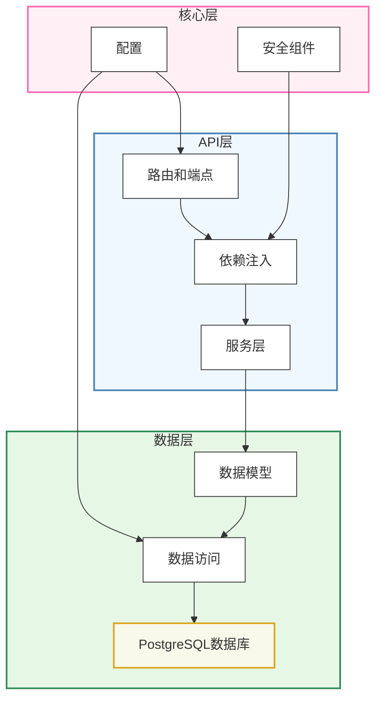

# 后端开发

Quick Forge AI后端使用FastAPI构建，这是一个用于使用Python构建API的现代、高性能web框架。本节涵盖了后端架构、关键组件以及如何根据需要扩展后端。

## 架构概述

后端遵循分层架构：



这种关注点分离使代码库更易于维护和扩展。

## 关键技术

- **FastAPI**：高性能Web框架
- **SQLModel**：类型安全的SQL数据库交互
- **Pydantic**：数据验证和设置管理
- **Alembic**：数据库迁移系统
- **JWT**：认证令牌
- **Pytest**：测试框架

## 目录结构

```
backend/
├── app/
│   ├── api/             # API端点和路由
│   │   ├── deps.py      # 依赖注入
│   │   └── routes/      # API路由模块
│   ├── core/            # 核心配置
│   │   ├── config.py    # 应用设置
│   │   └── security.py  # 安全工具
│   ├── db/              # 数据库
│   │   ├── base.py      # 基础模型
│   │   ├── session.py   # 数据库会话
│   │   └── models/      # 数据库模型
│   ├── services/        # 业务逻辑
│   ├── utils/           # 工具函数
│   └── main.py          # 应用入口点
├── tests/               # 测试模块
├── alembic/             # 数据库迁移
│   └── versions/        # 迁移脚本
└── pyproject.toml       # 项目依赖
```

## 开始后端开发

要开始后端开发：

1. **理解现有代码**：
   - 熟悉`app/api/routes/`中的API路由
   - 查看`app/db/models/`中的数据模型
   - 查看`app/services/`中的服务实现

2. **设置开发环境**：
   - 按照[设置说明](/zh/docs/getting-started)进行操作
   - 激活Python虚拟环境
   - 使用热重载运行后端：`uvicorn app.main:app --reload`

3. **访问API文档**：
   - 运行后，在`http://localhost:8000/docs`查看Swagger UI
   - OpenAPI架构位于`http://localhost:8000/api/v1/openapi.json`

## 主要组件

### API路由

API路由按功能区域组织在`app/api/routes/`目录中。每个模块包含相关端点，例如：

- `users.py` - 用户管理操作
- `auth.py` - 认证和授权
- `items.py` - 项目CRUD操作

### 依赖注入

FastAPI的依赖注入系统被广泛用于：
- 注入数据库会话
- 验证认证和权限
- 共享常见功能

依赖项在`app/api/deps.py`中定义。

### 数据库模型

数据模型使用SQLModel定义，它结合了SQLAlchemy和Pydantic的优点。模型位于`app/db/models/`。

### 业务逻辑

复杂业务逻辑被分离到`app/services/`中的服务模块，使路由处理程序保持简洁并专注于HTTP关注点。

## 核心功能

### 用户管理

系统提供完整的用户管理功能：

- 用户注册和登录
- 角色和权限管理
- 密码重置
- 用户资料更新

### 认证和授权

安全系统基于：

- JWT令牌认证
- 基于角色的访问控制
- 安全密码哈希处理
- 防护措施防止常见攻击

### 数据验证

所有输入数据通过Pydantic模型验证：

- 类型检查（运行时和静态，带有TypeScript导出）
- 字段约束（最小/最大长度，正则表达式等）
- 复杂业务规则验证

### 数据库交互

数据访问通过：

- SQLModel ORM
- 异步数据库操作
- 事务支持
- Alembic数据库迁移

## 扩展后端

要扩展后端功能：

1. **定义数据模型**：
   - 在`app/db/models/`中创建新的SQLModel类
   - 运行Alembic迁移来更新数据库结构

2. **实现服务层**：
   - 在`app/services/`中添加业务逻辑
   - 保持服务独立于HTTP和数据库关注点

3. **创建API路由**：
   - 在`app/api/routes/`中添加新端点
   - 在`app/api/api.py`中注册路由

4. **编写测试**：
   - 为新功能添加单元和集成测试
   - 确保与现有功能的兼容性

## 帮助指南

### 详细文档

查看这些主题以了解有关后端的更多信息：

- [FastAPI开发流程](/zh/docs/backend/development-workflow)
- [认证系统](/zh/docs/backend/fastapi-authentication-and-security)
- [数据库模型](/zh/docs/backend/fastapi-models-and-database)
- [API端点和路由](/zh/docs/backend/fastapi-api-endpoints)
- [配置设置](/zh/docs/backend/fastapi-configuration)
- [组件和布局](/zh/docs/backend/components-and-layout)
- [路由和导航](/zh/docs/backend/routes-and-navigation)

### 开发最佳实践

- **保持路由简单**：将业务逻辑移至服务层
- **使用依赖注入**：复用常见功能和进行访问控制
- **验证所有输入**：使用Pydantic模型确保数据完整性
- **编写测试**：为所有关键功能编写单元和集成测试
- **遵循API设计原则**：使用适当的HTTP方法、状态码和响应格式

## 故障排除

### 常见问题

1. **数据库迁移错误**：
   - 确保已应用所有迁移：`alembic upgrade head`
   - 检查模型更改是否与迁移脚本一致

2. **认证问题**：
   - 验证JWT令牌配置（密钥、算法、到期时间）
   - 检查依赖链中的权限验证

3. **性能问题**：
   - 优化数据库查询和索引
   - 实现缓存策略
   - 使用数据库分析工具识别瓶颈

### 调试技巧

- 使用Swagger UI(`/docs`)测试API端点
- 检查日志输出以获取详细错误信息
- 使用FastAPI的调试模式：`uvicorn app.main:app --reload --debug`