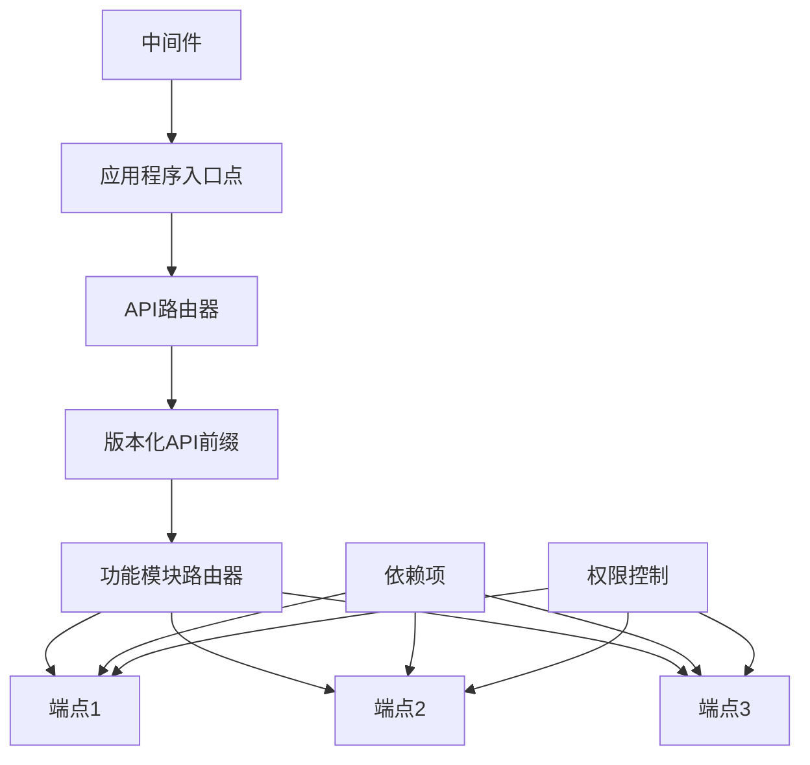
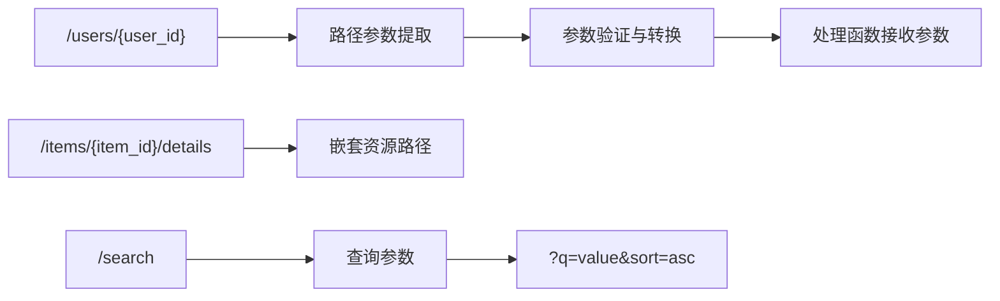
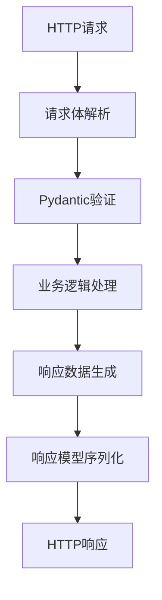
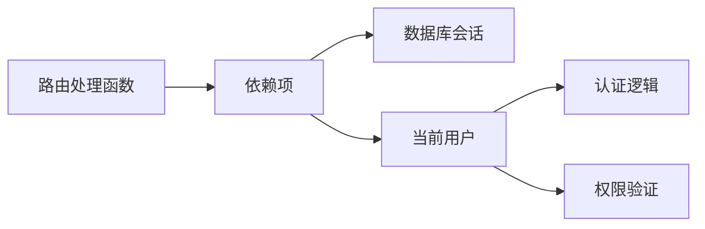
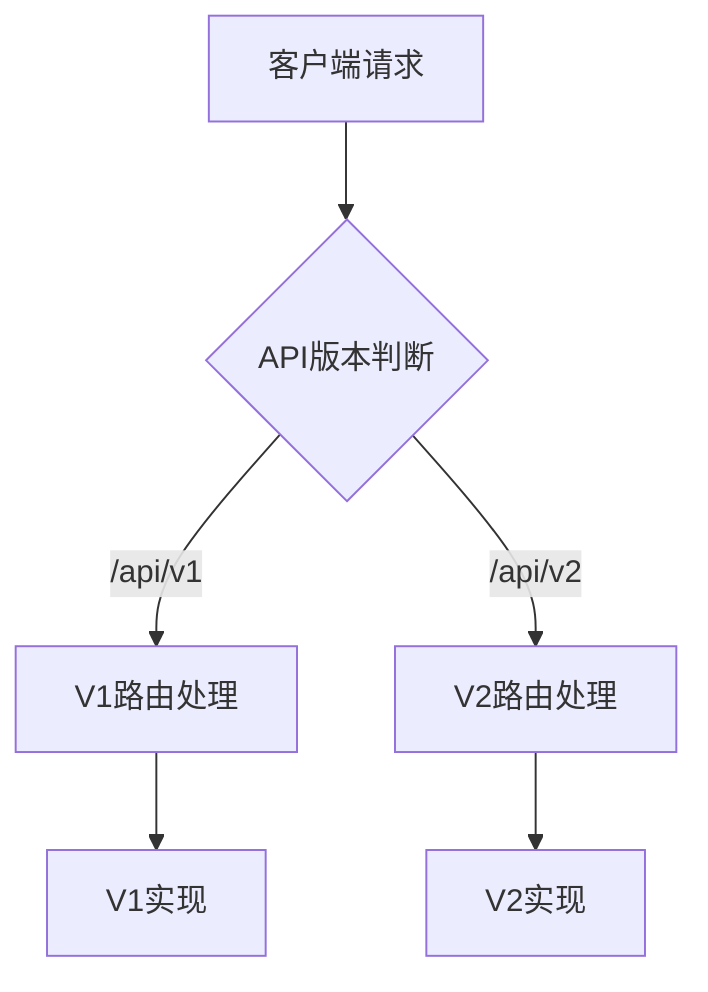

# FastAPI路由和导航

本文档详细介绍Quick Forge AI项目中FastAPI全栈模板的路由系统架构、导航结构以及如何高效组织和管理API端点。通过理解这些关键概念，您可以更有效地构建和扩展您的Web API。

## 路由系统概述

在Quick Forge AI项目中，FastAPI的路由系统被组织成模块化、分层的结构，以确保代码的可维护性和可扩展性。



## 路由组织结构

Quick Forge AI项目中的路由按照功能模块进行组织，每个模块都有自己的路由文件：

```
app/
├── api/
│   ├── routes/
│   │   ├── __init__.py    # 导出所有路由器
│   │   ├── auth.py        # 认证相关端点
│   │   ├── users.py       # 用户管理端点
│   │   ├── items.py       # 项目管理端点
│   │   └── ai.py          # AI功能相关端点
```

每个路由模块都定义了一个`APIRouter`实例，然后在主应用中进行注册。这种方法使得API端点的组织清晰，易于维护。

## 路由器的创建与注册

### 1. 定义路由模块

每个功能模块定义自己的路由器：

```python
# app/api/routes/users.py
from fastapi import APIRouter, Depends, HTTPException
from sqlalchemy.orm import Session

from app.api.dependencies.database import get_db
from app.api.dependencies.auth import get_current_active_user
from app.schemas.user import UserCreate, UserUpdate, UserOut
from app.services.user_service import (
    create_new_user, 
    get_user_by_id,
    update_existing_user
)

router = APIRouter(prefix="/users", tags=["users"])

@router.post("/", response_model=UserOut, status_code=201)
def create_user(
    user_in: UserCreate, 
    db: Session = Depends(get_db)
):
    """创建新用户"""
    return create_new_user(db=db, user_in=user_in)

@router.get("/{user_id}", response_model=UserOut)
def get_user(
    user_id: int,
    current_user = Depends(get_current_active_user),
    db: Session = Depends(get_db)
):
    """获取用户详情"""
    return get_user_by_id(db=db, user_id=user_id)

@router.put("/{user_id}", response_model=UserOut)
def update_user(
    user_id: int,
    user_in: UserUpdate,
    current_user = Depends(get_current_active_user),
    db: Session = Depends(get_db)
):
    """更新用户信息"""
    return update_existing_user(db=db, user_id=user_id, user_in=user_in)
```

### 2. 在主应用中注册路由器

所有路由器都在主应用入口点中注册：

```python
# app/main.py
from fastapi import FastAPI
from app.api.routes import auth, users, items, ai
from app.core.config import settings

app = FastAPI(
    title=settings.PROJECT_NAME,
    description=settings.PROJECT_DESCRIPTION,
    version=settings.VERSION
)

# API版本前缀
api_prefix = "/api/v1"

# 注册路由器
app.include_router(auth.router, prefix=api_prefix)
app.include_router(users.router, prefix=api_prefix)
app.include_router(items.router, prefix=api_prefix)
app.include_router(ai.router, prefix=api_prefix)
```

## 路由路径与路径参数

FastAPI提供了强大的路径参数功能，使您能够创建动态路由：



### 路径参数类型

FastAPI自动验证和转换路径参数类型：

```python
@router.get("/items/{item_id}")
def read_item(item_id: int):  # 自动将字符串转换为整数并验证
    return {"item_id": item_id}

@router.get("/files/{file_path:path}")  # 匹配整个路径，包括/字符
def read_file(file_path: str):
    return {"file_path": file_path}
```

## 查询参数和分页

查询参数用于过滤、排序和分页：

```python
@router.get("/items/")
def list_items(
    skip: int = 0,
    limit: int = 100,
    q: Optional[str] = None,
    sort: Optional[str] = None
):
    """
    获取项目列表，支持：
    - 分页 (skip, limit)
    - 搜索 (q)
    - 排序 (sort)
    """
    return {
        "skip": skip,
        "limit": limit,
        "q": q,
        "sort": sort
    }
```

### 分页模式实现

Quick Forge AI使用统一的分页模式：

```python
# app/schemas/common.py
from pydantic import BaseModel
from typing import Generic, TypeVar, List, Optional

T = TypeVar('T')

class PaginationParams(BaseModel):
    skip: int = 0
    limit: int = 100
    
class PaginatedResponse(BaseModel, Generic[T]):
    items: List[T]
    total: int
    skip: int
    limit: int
    
    class Config:
        arbitrary_types_allowed = True
```

在路由中使用：

```python
@router.get("/items/", response_model=PaginatedResponse[ItemOut])
def list_items(
    commons: PaginationParams = Depends(),
    db: Session = Depends(get_db)
):
    items = get_items(db=db, skip=commons.skip, limit=commons.limit)
    total = get_items_count(db=db)
    
    return {
        "items": items,
        "total": total,
        "skip": commons.skip,
        "limit": commons.limit
    }
```

## 请求体和响应模型

FastAPI使用Pydantic模型进行请求验证和响应序列化：



### 请求体定义

```python
# app/schemas/item.py
from pydantic import BaseModel, Field
from typing import Optional
from datetime import datetime

class ItemBase(BaseModel):
    title: str = Field(..., min_length=1, max_length=100)
    description: Optional[str] = Field(None, max_length=1000)
    
class ItemCreate(ItemBase):
    pass
    
class ItemUpdate(ItemBase):
    title: Optional[str] = Field(None, min_length=1, max_length=100)
    
class ItemOut(ItemBase):
    id: int
    owner_id: int
    created_at: datetime
    updated_at: Optional[datetime] = None
    
    class Config:
        orm_mode = True
```

### 响应模型使用

```python
@router.post("/items/", response_model=ItemOut, status_code=201)
def create_item(
    item_in: ItemCreate,
    current_user = Depends(get_current_active_user),
    db: Session = Depends(get_db)
):
    """创建新项目"""
    return create_new_item(db=db, item_in=item_in, owner_id=current_user.id)
```

## 路由标签和文档分组

Quick Forge AI使用标签组织API文档：

```python
# 定义带标签的路由器
router = APIRouter(
    prefix="/users",
    tags=["users"],
    responses={404: {"description": "未找到"}},
)
```

标签在OpenAPI文档中创建分组：

```python
# app/main.py中定义标签顺序和描述
app = FastAPI(
    # ... 其他设置
    openapi_tags=[
        {
            "name": "auth",
            "description": "身份验证和授权操作",
        },
        {
            "name": "users",
            "description": "用户管理操作",
        },
        {
            "name": "items",
            "description": "项目管理操作",
        },
        {
            "name": "ai",
            "description": "AI功能和集成",
        },
    ],
)
```

## 依赖注入与路由保护

依赖项用于共享逻辑和保护路由：



### 路由级别依赖

```python
# 所有端点共享的依赖
router = APIRouter(
    dependencies=[Depends(get_current_active_user)],
)
```

### 端点级别依赖

```python
@router.get("/admin-panel/", dependencies=[Depends(get_current_admin_user)])
def admin_panel():
    return {"message": "Admin panel"}
```

### 分层权限系统

Quick Forge AI使用分层权限系统控制API访问：

```python
# app/api/dependencies/auth.py
def get_current_user(...) -> User:
    """获取当前已认证用户"""
    pass

def get_current_active_user(
    current_user: User = Depends(get_current_user),
) -> User:
    """确保用户账号处于活动状态"""
    if not current_user.is_active:
        raise HTTPException(status_code=400, detail="账号未激活")
    return current_user

def get_current_admin_user(
    current_user: User = Depends(get_current_active_user),
) -> User:
    """检查用户是否为管理员"""
    if not current_user.is_superuser:
        raise HTTPException(
            status_code=403, 
            detail="权限不足"
        )
    return current_user
```

## 高级路由技术

### 1. 子应用程序挂载

对于大型项目，可以创建子应用并挂载到主应用：

```python
main_app = FastAPI()
admin_app = FastAPI()

@admin_app.get("/dashboard/")
def read_dashboard():
    return {"message": "Admin dashboard"}

main_app.mount("/admin", admin_app)
```

### 2. 自定义路由类

Quick Forge AI实现了自定义路由类处理通用CRUD操作：

```python
# app/api/routes/base.py
from fastapi import APIRouter, Depends, HTTPException
from typing import Type, Generic, TypeVar, List
from pydantic import BaseModel
from sqlalchemy.orm import Session

from app.api.dependencies.database import get_db
from app.api.dependencies.auth import get_current_active_user
from app.schemas.common import PaginationParams, PaginatedResponse

SchemaType = TypeVar("SchemaType", bound=BaseModel)
CreateType = TypeVar("CreateType", bound=BaseModel)
UpdateType = TypeVar("UpdateType", bound=BaseModel)

class CRUDRouter(Generic[SchemaType, CreateType, UpdateType]):
    """通用CRUD路由器基类"""
    
    def __init__(
        self,
        schema: Type[SchemaType],
        create_schema: Type[CreateType],
        update_schema: Type[UpdateType],
        service,
        prefix: str,
        tags: List[str],
    ):
        self.router = APIRouter(prefix=prefix, tags=tags)
        self.schema = schema
        self.service = service
        
        # 注册CRUD路由
        self._register_routes(create_schema, update_schema)
    
    def _register_routes(self, create_schema, update_schema):
        # 创建
        @self.router.post("/", response_model=self.schema, status_code=201)
        def create(
            item_in: create_schema,
            db: Session = Depends(get_db),
            current_user = Depends(get_current_active_user)
        ):
            return self.service.create(db=db, obj_in=item_in, owner_id=current_user.id)
            
        # 获取列表
        @self.router.get("/", response_model=PaginatedResponse[self.schema])
        def list_all(
            commons: PaginationParams = Depends(),
            db: Session = Depends(get_db)
        ):
            items = self.service.get_multi(db=db, skip=commons.skip, limit=commons.limit)
            total = self.service.count(db=db)
            return {
                "items": items,
                "total": total,
                "skip": commons.skip,
                "limit": commons.limit
            }
            
        # 获取单个
        @self.router.get("/{id}", response_model=self.schema)
        def get(
            id: int,
            db: Session = Depends(get_db)
        ):
            item = self.service.get(db=db, id=id)
            if not item:
                raise HTTPException(status_code=404, detail="项目不存在")
            return item
            
        # 更新
        @self.router.put("/{id}", response_model=self.schema)
        def update(
            id: int,
            item_in: update_schema,
            db: Session = Depends(get_db),
            current_user = Depends(get_current_active_user)
        ):
            item = self.service.get(db=db, id=id)
            if not item:
                raise HTTPException(status_code=404, detail="项目不存在")
            
            # 检查所有权
            if item.owner_id != current_user.id and not current_user.is_superuser:
                raise HTTPException(status_code=403, detail="权限不足")
                
            return self.service.update(db=db, db_obj=item, obj_in=item_in)
            
        # 删除
        @self.router.delete("/{id}", status_code=204)
        def delete(
            id: int,
            db: Session = Depends(get_db),
            current_user = Depends(get_current_active_user)
        ):
            item = self.service.get(db=db, id=id)
            if not item:
                raise HTTPException(status_code=404, detail="项目不存在")
                
            # 检查所有权
            if item.owner_id != current_user.id and not current_user.is_superuser:
                raise HTTPException(status_code=403, detail="权限不足")
                
            self.service.remove(db=db, id=id)
            return None
```

使用通用路由器：

```python
# app/api/routes/items.py
from app.schemas.item import ItemOut, ItemCreate, ItemUpdate
from app.services.item_service import item_service
from app.api.routes.base import CRUDRouter

router = CRUDRouter(
    schema=ItemOut,
    create_schema=ItemCreate,
    update_schema=ItemUpdate,
    service=item_service,
    prefix="/items",
    tags=["items"]
).router
```

## API版本控制策略

Quick Forge AI采用URL路径前缀方法进行API版本控制：



版本控制实现：

```python
# app/main.py
from fastapi import FastAPI
from app.api.v1.routes import router as router_v1
from app.api.v2.routes import router as router_v2

app = FastAPI()

# 注册不同版本的API
app.include_router(router_v1, prefix="/api/v1")
app.include_router(router_v2, prefix="/api/v2")
```

## 导航与路由最佳实践

基于Quick Forge AI项目的经验，我们推荐以下路由和导航最佳实践：

1. **采用一致的命名约定**：
   - 使用复数名词命名资源端点 (`/users`, `/items`)
   - 使用动词命名动作端点 (`/auth/login`, `/users/me/reset-password`)

2. **嵌套资源使用合理的嵌套路径**：
   ```
   /users/{user_id}/items/{item_id}
   ```

3. **版本控制所有API端点**

4. **始终提供分页、排序和过滤机制**

5. **使用合适的HTTP方法和状态码**：
   - GET: 获取资源
   - POST: 创建资源
   - PUT/PATCH: 更新资源
   - DELETE: 删除资源

6. **为每个端点提供清晰的描述文档**

7. **实现HATEOAS（超媒体作为应用状态引擎）原则**：
   ```python
   @router.get("/users/{user_id}", response_model=UserWithLinks)
   def get_user(user_id: int):
       # ...
       return {
           "id": user.id,
           "name": user.name,
           # ...其他属性
           "links": {
               "self": f"/api/v1/users/{user.id}",
               "items": f"/api/v1/users/{user.id}/items",
               "update": f"/api/v1/users/{user.id}"
           }
       }
   ```

## 结论

Quick Forge AI中的FastAPI路由系统设计注重模块化、易用性和可扩展性。通过将路由组织为功能模块，使用版本控制策略，实现通用CRUD操作，以及采用适当的权限验证机制，我们构建了一个健壮且易于维护的API架构。

这种设计支持项目随着业务需求的增长而轻松扩展，同时保持代码的一致性和可读性。掌握这些路由和导航概念将帮助您更有效地构建和扩展Quick Forge AI项目中的API端点。 